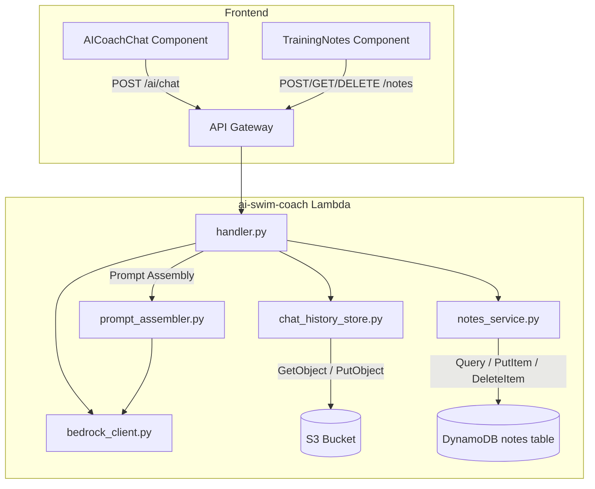

# Design Document: AI Coach Context

## Overview

This feature adds conversational memory and personal notes to the AI Swim Coach. Two capabilities are introduced:

1. **Chat History Persistence** — Q&A exchanges are saved to S3 (`chat-history/{user_id}/history.json`) and replayed as context in subsequent Bedrock prompts, giving the coach continuity across sessions.
2. **Training Notes** — Swimmers record short observations (injuries, group changes, illness) in a DynamoDB table. The AI reads recent notes when generating responses, allowing it to explain anomalies.

Both data sources feed into the existing `POST /ai/chat` endpoint's prompt assembly, enriching Bedrock's context without changing the response contract.

## Architecture



### Key Design Decisions

| Decision | Rationale |
|----------|-----------|
| Single JSON file per user for chat history | Simpler than per-message objects; 50 entries × ~3 KB avg = ~150 KB max — well within S3 single-object performance |
| DynamoDB for notes (not S3) | Notes require individual CRUD operations and indexed queries; DynamoDB's partition/sort key model fits naturally |
| Prompt assembly as a separate module | Keeps the handler thin; makes the context-building logic independently testable |
| 10-exchange / 4000-char dual limit | 10 exchanges gives meaningful context; 4000-char budget guards against blowing the model's useful context window |
| Best-effort persistence | Chat history save failures don't block the user response — coaching availability > data durability |

## Components and Interfaces

### 1. `backend/chat_history_store.py` (new)

Responsible for reading and writing the per-user chat history JSON file in S3.

```python
@dataclass
class QAEntry:
    user_prompt: str       # max 2000 chars
    ai_response: str
    timestamp: str         # ISO 8601 UTC

def get_history(user_id: str) -> list[QAEntry]:
    """Read history from S3. Returns [] on missing key or read failure."""

def save_history(user_id: str, history: list[QAEntry]) -> None:
    """Write full history list to S3. Enforces 50-entry cap (drops oldest)."""

def append_entry(user_id: str, entry: QAEntry) -> None:
    """Read-modify-write: append entry, enforce 50-cap, persist."""
```

**S3 key**: `chat-history/{user_id}/history.json`
**Bucket**: env var `S3_BUCKET` (existing: `ai-swim-coach-data-562535532900`)

### 2. `backend/notes_service.py` (new)

Handles CRUD for user training notes in DynamoDB.

```python
@dataclass
class TrainingNote:
    user_id: str
    note_id: str           # UUID v4
    text: str              # 1-500 chars (trimmed)
    timestamp: str         # ISO 8601 UTC

def create_note(user_id: str, text: str) -> TrainingNote:
    """Validate, generate ID + timestamp, persist to DynamoDB. Raises ValueError on invalid text."""

def get_notes(user_id: str, limit: int = 200) -> list[TrainingNote]:
    """Query notes for user, ordered by timestamp desc, capped at limit."""

def delete_note(user_id: str, note_id: str) -> bool:
    """Delete note if it belongs to user. Returns True on success, raises NotFoundError otherwise."""
```

**Table**: `ai-swim-coach-notes`
**Env var**: `NOTES_TABLE` (defaults to `ai-swim-coach-notes`)

### 3. `backend/prompt_assembler.py` (new)

Assembles the Bedrock messages array from conversation history and notes context.

```python
def build_chat_messages(
    current_prompt: str,
    conversation_history: list[dict],   # from request body or S3
    notes: list[TrainingNote],
    max_exchanges: int = 10,
    max_history_chars: int = 4000,
    max_notes: int = 20,
) -> tuple[str, list[dict]]:
    """
    Returns (system_prompt, messages_array) ready for Bedrock invocation.
    
    - Filters malformed history entries (missing role/content)
    - Orders history chronologically (oldest first)
    - Truncates to max_exchanges
    - Applies character budget (removes oldest until ≤ max_history_chars)
    - Formats notes as "[timestamp]: [text]" lines in the system prompt
    - Appends current_prompt as final user message
    """
```

### 4. Modified `backend/handler.py`

The `_handle_ai_chat` function gains:
- Retrieval of S3 chat history (best-effort)
- Retrieval of DynamoDB notes (best-effort)
- Delegation to `prompt_assembler.build_chat_messages()`
- Post-response persistence of the new Q&A entry to S3 (best-effort)

New route handlers:
- `_handle_create_note` → `POST /notes`
- `_handle_get_notes` → `GET /notes`
- `_handle_delete_note` → `DELETE /notes/{note_id}`

### 5. Frontend: Modified `AICoachChat` Component

Changes:
- Maintains local `conversationHistory` state (array of `{role, content}` pairs)
- Sends `conversation_history` in the POST body alongside `prompt`
- On successful response, appends both user message and AI response to local state

### 6. Frontend: New `TrainingNotes` Component

Located on the `DashboardPage`. Provides:
- Multi-line textarea (max 500 chars, placeholder "Add a training note...")
- Submit button (disabled when empty/whitespace or loading)
- Reverse-chronological list of notes with relative timestamps and delete buttons
- Optimistic UI with rollback on failure

### 7. Frontend: New `frontend/src/api/notesService.ts`

```typescript
export interface TrainingNote {
  note_id: string;
  text: string;
  timestamp: string;
}

export async function createNote(text: string): Promise<TrainingNote>;
export async function getNotes(): Promise<TrainingNote[]>;
export async function deleteNote(noteId: string): Promise<void>;
```

## Data Models

### Chat History JSON Schema (S3)

```json
{
  "entries": [
    {
      "user_prompt": "How is my technique trending?",
      "ai_response": "Your SWOLF has improved by 3 points over...",
      "timestamp": "2025-01-15T10:30:00.000Z"
    }
  ]
}
```

**Constraints:**
- `entries` array: max 50 items
- `user_prompt`: string, 1–2000 characters
- `ai_response`: string, non-empty
- `timestamp`: ISO 8601 UTC string

### Notes DynamoDB Table Schema

| Attribute | Type | Key |
|-----------|------|-----|
| `user_id` | String | Partition Key |
| `note_id` | String (UUID v4) | Sort Key |
| `text` | String (1–500 chars) | — |
| `timestamp` | String (ISO 8601 UTC) | — |

**Table name**: `ai-swim-coach-notes`

**IAM**: Add `dynamodb:PutItem`, `dynamodb:Query`, `dynamodb:DeleteItem` on `arn:aws:dynamodb:*:562535532900:table/ai-swim-coach-notes` to the `ai-swim-coach-lambda-permissions` inline policy.

**S3 permissions**: The existing S3 policy on `ai-swim-coach-data-562535532900` already grants the Lambda role `GetObject`/`PutObject`; the new `chat-history/` prefix is covered.

### API Contracts

#### POST /ai/chat (modified)

**Request body** (additions in bold):

```json
{
  "prompt": "How is my technique trending?",
  "current_session": { "pace": 92.5, "swolf": 38 },
  "intents": ["technique"],
  "conversation_history": [
    { "role": "user", "content": "What's my SWOLF trend?" },
    { "role": "assistant", "content": "Your SWOLF improved by..." }
  ]
}
```

**Response** (unchanged):

```json
{
  "response": "Based on our earlier discussion about your SWOLF..."
}
```

**Behavior changes:**
- Accepts optional `conversation_history` array
- Retrieves notes from DynamoDB (best-effort)
- Retrieves stored history from S3 (best-effort, used if `conversation_history` not provided)
- Persists the new Q&A pair to S3 after response

#### POST /notes

**Request:**
```json
{ "text": "Shoulder felt tight after 1500m" }
```

**Response (201):**
```json
{
  "note_id": "a1b2c3d4-...",
  "text": "Shoulder felt tight after 1500m",
  "timestamp": "2025-01-15T10:30:00.000Z"
}
```

**Errors:** 400 (validation), 401 (unauth), 500 (storage)

#### GET /notes

**Response (200):**
```json
{
  "notes": [
    {
      "note_id": "a1b2c3d4-...",
      "text": "Shoulder felt tight after 1500m",
      "timestamp": "2025-01-15T10:30:00.000Z"
    }
  ]
}
```

Returns up to 200 notes, ordered by timestamp descending.

#### DELETE /notes/{note_id}

**Response (200):**
```json
{ "message": "Note deleted" }
```

**Errors:** 401 (unauth), 404 (not found / not owned), 500 (storage)

## Correctness Properties

*A property is a characteristic or behavior that should hold true across all valid executions of a system — essentially, a formal statement about what the system should do. Properties serve as the bridge between human-readable specifications and machine-verifiable correctness guarantees.*

### Property 1: Chat history round-trip

*For any* list of valid Q&A entries (each with a non-empty user prompt ≤ 2000 chars, a non-empty AI response, and a valid ISO 8601 timestamp), serializing to the S3 JSON format and then deserializing SHALL produce an equivalent list of entries.

**Validates: Requirements 1.2, 1.8**

### Property 2: History size bounded at 50

*For any* sequence of N append operations (N ≥ 1) on a user's chat history, the resulting stored history SHALL contain at most 50 entries, and when N > 50 the oldest N − 50 entries SHALL have been discarded.

**Validates: Requirements 1.7, 6.1, 6.2**

### Property 3: Prompt includes at most 10 most-recent exchanges

*For any* conversation history of N exchanges (N ≥ 0), the prompt assembly function SHALL include min(N, 10) exchanges, and those exchanges SHALL be the 10 with the most recent timestamps.

**Validates: Requirements 1.4, 2.3**

### Property 4: Conversation history chronological ordering

*For any* set of valid conversation history entries, the messages array produced by prompt assembly SHALL be ordered chronologically (oldest first) with the current user prompt as the final message.

**Validates: Requirements 2.1, 2.2**

### Property 5: Malformed entries filtered

*For any* conversation history array containing a mix of valid entries (with both `role` and `content` fields) and malformed entries (missing one or both fields), the prompt assembly output SHALL contain exactly the valid entries and zero malformed entries.

**Validates: Requirements 2.6**

### Property 6: Note text validation

*For any* string input, the notes validation function SHALL accept the input if and only if the trimmed string length is between 1 and 500 characters inclusive.

**Validates: Requirements 3.2, 3.3**

### Property 7: Note deletion ownership

*For any* note belonging to user A and any delete request from user B, the deletion SHALL succeed if and only if A equals B.

**Validates: Requirements 3.5, 3.6**

### Property 8: Notes retrieval ordering and bound

*For any* set of notes stored for a user, the GET /notes response SHALL return notes ordered by timestamp descending, containing at most 200 entries.

**Validates: Requirements 3.4**

### Property 9: Relative timestamp formatting

*For any* timestamp T and current time NOW where T ≤ NOW, the relative format function SHALL return: "just now" when difference < 60s, "N minutes ago" when difference < 3600s, "N hours ago" when difference < 86400s, and "N days ago" otherwise.

**Validates: Requirements 4.7**

### Property 10: Notes in prompt limited and formatted

*For any* set of user notes (0 to 200), the prompt assembly SHALL include at most 20 notes, each formatted as "[ISO 8601 timestamp]: [note text]" on a separate line, ordered by timestamp descending.

**Validates: Requirements 5.2**

### Property 11: Character-budget truncation

*For any* conversation history, after prompt assembly applies the character budget, the total character count of all included Q&A exchanges (user prompts + AI responses) SHALL be ≤ 4000 characters, and entries SHALL be removed oldest-first until the budget is met.

**Validates: Requirements 6.3, 6.4**

## Error Handling

| Failure Scenario | Behavior | HTTP Status |
|------------------|----------|-------------|
| S3 GetObject fails (chat history) | Log ERROR with user_id, proceed without history | 200 (response still returned) |
| S3 PutObject fails (chat history save) | Log ERROR with user_id, return AI response anyway | 200 (response still returned) |
| DynamoDB Query fails (notes retrieval in chat) | Log ERROR, proceed without notes context | 200 (response still returned) |
| DynamoDB PutItem fails (note creation) | Return error to user | 500 |
| DynamoDB Query fails (GET /notes) | Return error to user | 500 |
| DynamoDB DeleteItem fails | Return error to user | 500 |
| Note text validation fails | Return validation error | 400 |
| Note not found or wrong owner | Return not found | 404 |
| Bedrock invocation fails | Return AI unavailable | 502 |

**Principle**: Chat history and notes retrieval for AI context are best-effort — failures degrade context richness but never block the user from getting a response. Direct CRUD operations on notes surface errors immediately since the user expects confirmation.

## Testing Strategy

### Property-Based Tests (Hypothesis, Python)

Property-based testing is appropriate here because the core logic involves data transformations (serialization, filtering, truncation, formatting) with clear input/output contracts and large input spaces.

**Library**: [Hypothesis](https://hypothesis.readthedocs.io/) (already in use — see `.hypothesis/` directory)

**Configuration**: Minimum 100 iterations per property (`@settings(max_examples=100)`)

Each property test references its design property:

```python
# Feature: ai-coach-context, Property 1: Chat history round-trip
# Feature: ai-coach-context, Property 2: History size bounded at 50
# ... etc.
```

**Test files:**
- `backend/tests/test_chat_history_store.py` — Properties 1, 2
- `backend/tests/test_prompt_assembler.py` — Properties 3, 4, 5, 10, 11
- `backend/tests/test_notes_service.py` — Properties 6, 7, 8
- `frontend/src/utils/relativeTime.test.ts` — Property 9 (using fast-check)

### Unit Tests (Example-Based)

- S3 retrieval failure → chat continues (Req 1.5)
- S3 persistence failure → response returned (Req 1.6)
- Empty conversation_history → single prompt sent (Req 2.4)
- System prompt includes continuity instruction (Req 2.5)
- Notes retrieval failure → chat continues (Req 5.4)
- System prompt includes notes context instruction (Req 5.5)
- DynamoDB failure → 500 response (Req 3.8)

### Integration Tests

- End-to-end: submit prompt → verify S3 history updated → submit follow-up → verify history in prompt
- Notes CRUD: create → list → delete → verify removed
- AI chat with notes: create note → send prompt → verify note context in Bedrock call

### Frontend Tests

- `TrainingNotes` component: renders input, submit flow, delete flow, error states
- `AICoachChat` modified: sends conversation_history, accumulates messages
- `relativeTime` utility: property-based with fast-check (Property 9)
