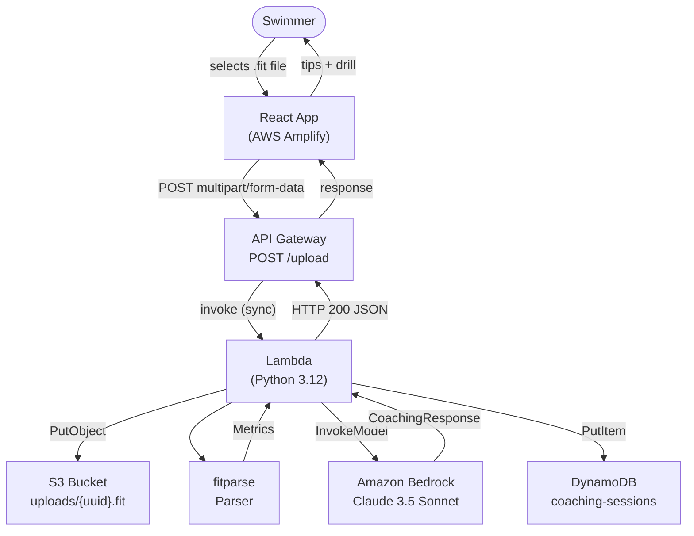

# Design Document: AI Swim Coach

## Overview

AI Swim Coach is a serverless web application that lets swimmers upload a Garmin `.fit` file and receive three AI-generated improvement tips plus one drill, all within a single HTTP round-trip. The user experience is intentionally minimal: upload a file, read your coaching feedback.

The system is split into two layers:

- **Frontend** — a React single-page application hosted on AWS Amplify, responsible for file selection, validation, submission, and result rendering.
- **Backend** — a fully serverless AWS pipeline: API Gateway → Lambda (Python) → S3 + fitparse + Bedrock + DynamoDB.

The design follows a linear processing pipeline inside Lambda with fail-fast semantics: each stage gates the next, returning a specific HTTP error code if it fails. This makes error diagnosis straightforward and prevents unnecessary downstream calls.

---

## Architecture



### Request / Response Flow

1. The browser validates the file (extension, size) and POSTs it as `multipart/form-data`.
2. API Gateway forwards the request to Lambda synchronously (29-second integration timeout). Binary media type `multipart/form-data` is registered so the body is base64-encoded in the Lambda event.
3. Lambda decodes the multipart body, extracts the raw `.fit` bytes, and writes them to S3 with a UUID-based key.
4. Lambda parses the file in-memory using `fitparse`, extracting pace, SWOLF, and stroke rate.
5. Lambda invokes Amazon Bedrock (Claude 3.5 Sonnet) with a structured tool-use call, enforcing the `{tips: [...], drill: "..."}` output schema.
6. Lambda persists the result to DynamoDB (non-blocking to the user if it fails).
7. Lambda returns HTTP 200 with the JSON coaching response.

---

## Components and Interfaces

### Frontend (`UploadPage` React Component)

The frontend is a single page with three states: **idle**, **uploading**, and **result** (or **error**).

**Component tree:**
```
<App>
  └─ <UploadPage>
       ├─ <FileDropZone>       — accepts/rejects files, triggers upload
       ├─ <LoadingIndicator>   — visible during upload
       ├─ <CoachingResult>     — renders tips and drill
       └─ <ErrorBanner>        — renders error messages with retry
```

**`<FileDropZone>` interface:**
- Accepts only `.fit` files (HTML `accept=".fit"` + JS extension check).
- Client-side size limit: 100 MB.
- Uses `react-dropzone` for accessible drag-and-drop (keyboard navigable, ARIA labels, live region announcements).
- Emits `onFileAccepted(file: File)` to trigger the upload handler.
- Emits `onFileRejected(reason: string)` to surface validation errors.

**`<CoachingResult>` interface:**
- Receives `{ tips: string[3], drill: string }` props.
- Renders each tip as a numbered list item with a heading label.
- Renders the drill in a visually distinct card/section (different background or border).

**API client (`src/api/upload.ts`):**
```typescript
async function uploadFitFile(file: File): Promise<CoachingResponse> {
  const formData = new FormData();
  formData.append("file", file);
  const response = await fetch(API_ENDPOINT + "/upload", {
    method: "POST",
    body: formData,
  });
  if (!response.ok) {
    const text = await response.text();
    throw new ApiError(response.status, text);
  }
  return response.json() as Promise<CoachingResponse>;
}
```

**Error mapping:**
| HTTP status | User-facing message |
|---|---|
| 400 | "The file could not be read — please try a different .fit file." |
| 413 | "The file is too large for this endpoint (max 10 MB)." |
| 422 | Body text from server (identifies missing metrics). |
| 502 | "Our AI coach is temporarily unavailable. Please try again." |
| 5xx | "A server error occurred. Please try again in a moment." |
| Network error | "Could not reach the server. Check your connection and retry." |

---

### API Gateway

- Type: **REST API** (not HTTP API) — required for binary media type support and 29-second integration timeout.
- Resource: `POST /upload`
- Binary media types: `multipart/form-data` registered so API Gateway base64-encodes the body.
- Payload limit: 10 MB (API Gateway hard limit for REST APIs; enforced by returning HTTP 413).
- Integration: AWS Lambda proxy integration (Lambda receives the full event including `isBase64Encoded`, `body`, `headers`).
- Method-not-allowed: API Gateway auto-returns 405 for unregistered HTTP methods on the resource.
- CORS: enabled on the `/upload` resource with `Access-Control-Allow-Origin: *` (or restricted to Amplify domain in production).
- Timeout: 29 seconds (maximum for Lambda proxy integration).

---

### Lambda Function (`handler.py`)

Runtime: **Python 3.12**. Single handler orchestrates all stages.

**Handler pipeline (pseudo-code):**
```python
def handler(event, context):
    # 1. Parse multipart body
    fit_bytes = parse_multipart(event)          # → HTTP 400 if missing
    # 2. Store in S3
    s3_key = store_in_s3(fit_bytes)             # → HTTP 500 if S3 fails
    # 3. Parse FIT file
    metrics = parse_fit(fit_bytes)              # → HTTP 422 if malformed/missing metrics
    # 4. Invoke Bedrock
    coaching = invoke_bedrock(metrics)          # → HTTP 502 if Bedrock fails (with 1 retry on parse failure)
    # 5. Persist to DynamoDB (best-effort)
    try:
        save_to_dynamodb(s3_key, metrics, coaching)
    except Exception as e:
        logger.error(f"DynamoDB write failed for {s3_key}: {e}")
    # 6. Return response
    return http_200(coaching)
```

**Dependencies (Lambda layer or packaged):**
- `fitparse` — FIT file parsing
- `boto3` — S3, Bedrock, DynamoDB clients (provided by Lambda runtime)
- `python-multipart` — multipart body decoding

**IAM permissions required:**
- `s3:PutObject` on the uploads bucket
- `bedrock:InvokeModel` on `anthropic.claude-3-5-sonnet-20240620-v1:0`
- `dynamodb:PutItem` on the coaching-sessions table

---

### Multipart Body Parser

API Gateway base64-encodes binary bodies when `isBase64Encoded: true` in the Lambda event. The parser:

1. Base64-decodes `event["body"]`.
2. Extracts the `Content-Type` header (which includes the `boundary` parameter).
3. Uses the `email.parser` stdlib module (or `python-multipart`) to split the multipart body and locate the part with `name="file"`.
4. Returns the raw bytes of that part.

Returns `HTTP 400` if no `file` part is found.

---

### FIT File Parser

```python
from fitparse import FitFile

def parse_fit(fit_bytes: bytes) -> Metrics:
    try:
        fitfile = FitFile(fit_bytes)
    except Exception as e:
        raise ParseError(f"Malformed FIT file: {e}")

    pace_values, swolf_values, stroke_rate_values = [], [], []

    # Prefer per-length records; fall back to lap records
    for record_type in ("length", "lap"):
        for record in fitfile.get_messages(record_type):
            data = {f.name: f.value for f in record}
            if "avg_speed" in data and data["avg_speed"]:
                pace_values.append(speed_to_pace(data["avg_speed"]))
            if "avg_swimming_cadence" in data and data["avg_swimming_cadence"] is not None:
                stroke_rate_values.append(data["avg_swimming_cadence"])
            swolf = compute_swolf(data)
            if swolf is not None:
                swolf_values.append(swolf)
        if pace_values or swolf_values or stroke_rate_values:
            break  # found per-length data; no need for lap fallback

    missing = []
    if not pace_values:   missing.append("pace")
    if not swolf_values:  missing.append("SWOLF")
    if not stroke_rate_values: missing.append("stroke_rate")
    if missing:
        raise MetricsMissingError(missing)

    return Metrics(
        pace=average(pace_values),
        swolf=average(swolf_values),
        stroke_rate=average(stroke_rate_values),
    )
```

SWOLF is computed as `avg_stroke_count + (length_in_meters / avg_speed)` where available from per-length fields. Pace is derived from `avg_speed` (m/s → seconds per 100 m).

---

### Bedrock Client

Uses the **Tool Use** (function calling) API to enforce structured JSON output — more reliable than prompt-only JSON extraction.

```python
TOOL_SCHEMA = {
    "name": "submit_coaching_response",
    "description": "Submit three swim improvement tips and one drill",
    "input_schema": {
        "type": "object",
        "properties": {
            "tips": {
                "type": "array",
                "items": {"type": "string", "maxLength": 300},
                "minItems": 3,
                "maxItems": 3
            },
            "drill": {"type": "string", "maxLength": 500}
        },
        "required": ["tips", "drill"]
    }
}

SYSTEM_PROMPT = """You are an elite competitive swim coach with decades of experience at national and Olympic level.
Analyse the swimmer's metrics and respond by calling the submit_coaching_response tool with:
- tips: exactly three concise, actionable improvement tips (each ≤ 300 characters) based on the metrics
- drill: exactly one specific drill recommendation (≤ 500 characters) that targets the swimmer's weakest area
Do not add any other fields or commentary outside the tool call."""
```

The Bedrock invocation uses `invoke_model` with `tool_choice={"type": "tool", "name": "submit_coaching_response"}` to force the model to call the tool.

**Retry logic:** On a non-2xx HTTP status or network exception → HTTP 502 immediately (no retry). On a successful HTTP 200 but response fails schema validation → retry once with the same inputs. If second attempt also fails schema validation → HTTP 502.

---

### DynamoDB Schema

**Table name:** `coaching-sessions`

| Attribute | Type | Role |
|---|---|---|
| `file_key` | String (S3 key, e.g. `uploads/{uuid}.fit`) | Partition key |
| `created_at` | String (ISO 8601 UTC ms, e.g. `2024-06-15T10:30:00.123Z`) | Sort key |
| `pace` | Number | Metric |
| `swolf` | Number | Metric |
| `stroke_rate` | Number | Metric |
| `tips` | List of Strings | Coaching response |
| `drill` | String | Coaching response |

No secondary indexes needed for the initial scope (auditing is key-based).

---

## Data Models

### `Metrics` (Python dataclass)

```python
@dataclass
class Metrics:
    pace: float          # seconds per 100 m, finite
    swolf: float         # dimensionless score, finite
    stroke_rate: float   # strokes per minute, finite
```

Invariant: all three fields must be finite floats (not NaN, not ±Infinity).

### `CoachingResponse` (Python dataclass)

```python
@dataclass
class CoachingResponse:
    tips: list[str]   # exactly 3 items, each non-empty, each ≤ 300 chars
    drill: str        # non-empty, ≤ 500 chars
```

### API Response JSON Schema

```json
{
  "type": "object",
  "required": ["tips", "drill"],
  "properties": {
    "tips": {
      "type": "array",
      "items": { "type": "string", "minLength": 1, "maxLength": 300 },
      "minItems": 3,
      "maxItems": 3
    },
    "drill": { "type": "string", "minLength": 1, "maxLength": 500 }
  }
}
```

### Lambda Event Shape (from API Gateway proxy integration)

```json
{
  "httpMethod": "POST",
  "path": "/upload",
  "headers": { "Content-Type": "multipart/form-data; boundary=----..." },
  "body": "<base64-encoded multipart body>",
  "isBase64Encoded": true
}
```

---

## Correctness Properties

*A property is a characteristic or behavior that should hold true across all valid executions of a system — essentially, a formal statement about what the system should do. Properties serve as the bridge between human-readable specifications and machine-verifiable correctness guarantees.*

### Property 1: Metrics finiteness invariant

*For any* FIT file that `fitparse` parses without error and that contains at least one pace, SWOLF, and stroke rate value, the resulting `Metrics` object shall have all three fields as finite numeric values (not NaN and not ±Infinity).

**Validates: Requirements 4.5**

---

### Property 2: Missing-metric error identifies all absent fields

*For any* FIT file that is parseable but missing one or more of the required metrics, the HTTP 422 response body shall identify every missing metric by name, and the set of reported missing names shall equal exactly the set of metrics absent from the file — no more, no fewer.

**Validates: Requirements 4.3**

---

### Property 3: CoachingResponse structural invariant

*For any* `Metrics` object that triggers a successful Bedrock invocation, the resulting `CoachingResponse` shall contain a `tips` list of exactly three items where each tip is a non-empty string no longer than 300 characters, and a `drill` that is a non-empty string no longer than 500 characters.

**Validates: Requirements 5.3, 7.2**

---

### Property 4: S3 key uniqueness and format

*For any* two independent calls to the S3 key-generation function, the produced keys shall be distinct, and each key shall match the pattern `uploads/{uuid}.fit` where `{uuid}` is a valid UUID v4.

**Validates: Requirements 3.2**

---

### Property 5: DynamoDB write failure does not suppress the coaching response

*For any* valid `CoachingResponse`, if the DynamoDB `PutItem` call raises an exception, the Lambda handler shall still return HTTP 200 with the full `CoachingResponse` JSON body to the caller.

**Validates: Requirements 6.3**

---

### Property 6: Client-side rejection of non-.fit files

*For any* filename that does not end with the `.fit` extension (regardless of MIME type or file content), the frontend file-validation function shall return a rejection result and shall not dispatch the upload API call.

**Validates: Requirements 1.1, 1.2**

---

### Property 7: Client-side rejection of oversized files

*For any* file whose `size` property exceeds 100 MB (104,857,600 bytes), the frontend file-validation function shall return a rejection result and shall not dispatch the upload API call.

**Validates: Requirements 1.3**

---

### Property 8: Frontend renders all content from any valid CoachingResponse

*For any* valid `CoachingResponse` object (three tips, one drill), when the frontend receives it in an HTTP 200 body, all three tip strings shall appear as labelled elements in the rendered output and the drill string shall appear in a distinct drill section — with no tips or drill content omitted.

**Validates: Requirements 1.6, 7.3**

---

### Property 9: Frontend displays error UI for any 4xx or 5xx response

*For any* HTTP status code in the range [400–499] or [500–599], when the frontend receives that response, it shall display an error message and shall not display the CoachingResponse result section. For 5xx responses, the error message shall include advice to retry.

**Validates: Requirements 1.8, 7.4, 7.5**

---

### Property 10: Per-length and per-lap fallback produce equivalent metrics

*For any* set of swim metric values (pace, SWOLF, stroke rate), if the same values are expressed as per-length records and also as per-lap records in otherwise identical FIT data, the parser shall produce `Metrics` objects with equivalent field values from both representations.

**Validates: Requirements 4.2**

---

### Property 11: DynamoDB record uses S3 key as partition key with ISO 8601 sort key

*For any* valid S3 key and coaching session, the item written to DynamoDB shall use the S3 key string as the `file_key` partition key, and the `created_at` sort key shall be a string that matches the ISO 8601 UTC millisecond-precision format (e.g. `2024-06-15T10:30:00.123Z`).

**Validates: Requirements 6.2**

---

## Error Handling

### Error taxonomy and HTTP codes

| Stage | Condition | HTTP Code | Body |
|---|---|---|---|
| Multipart parsing | No `file` part in body | 400 | `{"error": "No FIT file found in request"}` |
| S3 write | `boto3` exception | 500 | `{"error": "Failed to store file"}` |
| FIT parsing | `fitparse` raises exception | 422 | `{"error": "Malformed FIT file: <detail>"}` |
| FIT parsing | Missing metrics | 422 | `{"error": "Missing metrics: pace, SWOLF"}` (lists each) |
| Bedrock | Non-2xx or network exception | 502 | `{"error": "AI coach unavailable"}` |
| Bedrock | Parse failure after 1 retry | 502 | `{"error": "AI coach returned an invalid response"}` |
| DynamoDB | Write failure | — | Logged; HTTP 200 still returned |

### Lambda timeout

Lambda timeout is set to **28 seconds** (one second under the API Gateway 29-second limit) to ensure Lambda terminates before API Gateway forcibly kills the connection and returns a misleading error.

### Retry budget

Only the Bedrock structured-output validation retries (once). No other retries. The S3 and DynamoDB clients use default `boto3` retry configuration (3 attempts with exponential back-off for transient AWS errors).

### Frontend error recovery

After any error, the upload control is re-enabled. Network errors present a "Retry" button that re-runs the upload with the same file. 4xx errors show a descriptive message but no automatic retry (since the same request will fail again). 5xx errors show a "Try again" button.

---

## Testing Strategy

### Unit Tests (Python — `pytest`)

Test each stage in isolation with mocked AWS clients and synthetic FIT data:

- **Multipart parser**: valid body with file part, body without file part, empty body.
- **FIT parser**: well-formed file with all metrics, file missing each metric individually, malformed binary input.
- **SWOLF computation**: known pace + stroke count inputs → expected SWOLF.
- **Bedrock client**: mocked `invoke_model` returning valid tool-use response, malformed response, non-2xx response.
- **DynamoDB writer**: successful write, exception → verify HTTP 200 still returned.
- **Response builder**: verifies JSON output shape matches schema.

### Property-Based Tests (Python — `hypothesis`, JS — `fast-check`)

Each property test runs a minimum of 100 iterations. Tests are tagged with the design property they validate.

**Feature: ai-swim-coach, Property 1: Metrics finiteness invariant**
Generate triples of finite floats representing raw metric values; feed through the metric-computation pipeline; assert all output fields satisfy `math.isfinite`.

**Feature: ai-swim-coach, Property 2: Missing-metric error identifies all absent fields**
Generate FIT-like data dicts with random non-empty subsets of metrics absent; assert the 422 response body lists exactly those absent metric names.

**Feature: ai-swim-coach, Property 3: CoachingResponse structural invariant**
Generate arbitrary tool-use JSON payloads with 3 tips and 1 drill of varying string content; assert `len(tips) == 3`, all tips non-empty and ≤ 300 chars, drill non-empty and ≤ 500 chars.

**Feature: ai-swim-coach, Property 4: S3 key uniqueness and format**
Generate N key values via the key-generation function; assert all are distinct and match `^uploads/[0-9a-f-]{36}\.fit$`.

**Feature: ai-swim-coach, Property 5: DynamoDB write failure does not suppress the coaching response**
For any valid `CoachingResponse`, inject a DynamoDB exception; assert the handler still returns `{"statusCode": 200}` with the full response body.

**Feature: ai-swim-coach, Property 6: Client-side rejection of non-.fit files** *(fast-check)*
Generate arbitrary filename strings not ending in `.fit`; assert the frontend validation function returns a rejection.

**Feature: ai-swim-coach, Property 7: Client-side rejection of oversized files** *(fast-check)*
Generate file-size integers > 104,857,600; assert the frontend validation function returns a rejection.

**Feature: ai-swim-coach, Property 8: Frontend renders all content from any valid CoachingResponse** *(fast-check)*
Generate random `CoachingResponse` objects (3 tips, 1 drill with varying string content); render the `<CoachingResult>` component; assert all three tips and the drill string appear in the output.

**Feature: ai-swim-coach, Property 9: Frontend displays error UI for any 4xx or 5xx response** *(fast-check)*
Generate HTTP status codes from [400–499] and [500–599]; mock fetch to return each; assert error message visible and coaching result absent.

**Feature: ai-swim-coach, Property 10: Per-length and per-lap fallback produce equivalent metrics**
For any set of metric values, construct synthetic FIT records in both per-length and per-lap format; assert parser produces equivalent `Metrics` from both.

**Feature: ai-swim-coach, Property 11: DynamoDB record uses S3 key as partition key with ISO 8601 sort key**
Generate arbitrary UUID-based S3 key strings; invoke the DynamoDB write function; assert the written item's `file_key` matches the input and `created_at` matches ISO 8601 UTC ms format.

### Integration Tests

- **S3 round-trip**: upload real FIT bytes to a test bucket, verify key format matches `uploads/{uuid}.fit`.
- **End-to-end (staging)**: upload a known FIT file through the deployed Amplify URL; assert HTTP 200 and valid JSON shape.
- **API Gateway method restriction**: send GET/PUT/DELETE to `/upload`; assert HTTP 405.
- **API Gateway payload limit**: send a POST > 10 MB; assert HTTP 413.

### Frontend Tests (Vitest + React Testing Library)

- File accepted: `.fit` file of valid size → upload triggered, loading indicator visible.
- File rejected (extension): non-`.fit` file → error message shown, no network call made.
- File rejected (size): `.fit` file > 100 MB → error message shown, no network call made.
- Success: mock API returns 200 with coaching JSON → tips and drill rendered.
- Error states: mock API returns 400, 413, 422, 502, 500, and network error → correct error messages rendered.
