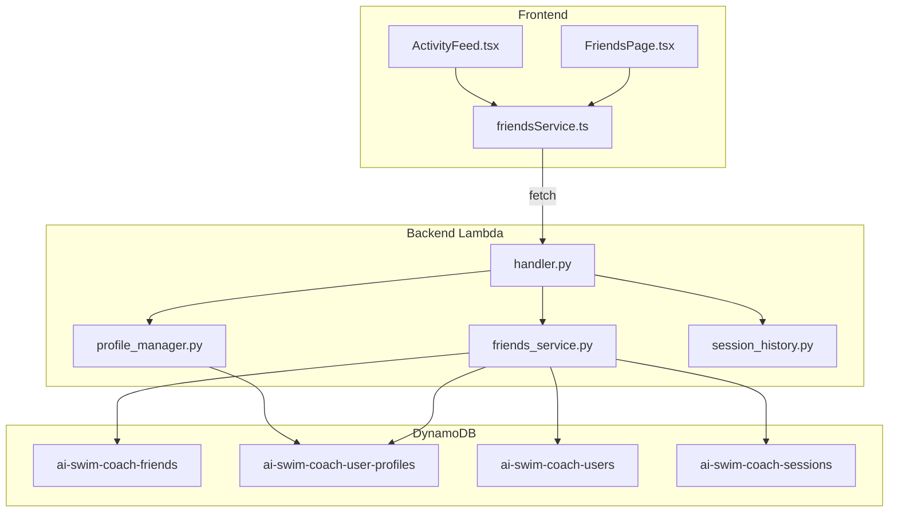
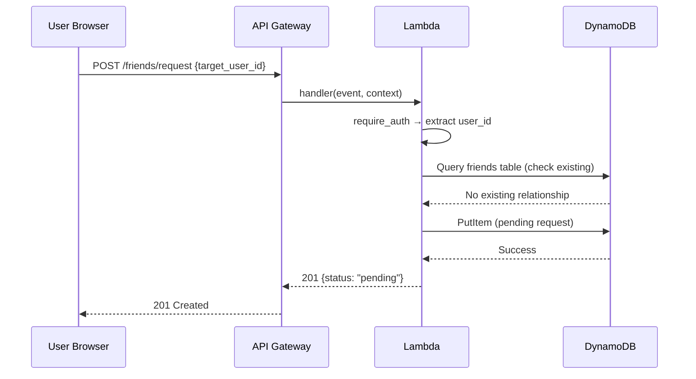

# Design Document: Friends Network

## Overview

The Friends Network feature adds a social layer to the AI Swim Coach app, enabling users to connect with fellow swimmers, manage friend relationships, control activity visibility, and view friends' swim sessions in a dashboard feed. The design extends the existing single-Lambda architecture with new API routes, a dedicated DynamoDB table for friend relationships, and frontend components for the Friends page and activity feed tabs.

### Key Design Decisions

1. **Single DynamoDB table with adjacency list pattern** — Friend relationships are stored as two reciprocal items (one per direction) to enable efficient queries from either user's perspective. Pending requests use a single item from sender to receiver.
2. **Privacy stored on user profiles table** — The `activity_visibility` field is added to the existing `ai-swim-coach-user-profiles` table rather than a separate table, keeping user preferences co-located.
3. **Existing Lambda handler extended** — New routes are added to `handler.py` following the established pattern of routing by method + path, with a new `friends_service.py` module.
4. **Debounced search** — The frontend debounces user search input (300ms) to avoid excessive API calls.

## Architecture



### Request Flow



## Components and Interfaces

### Backend Components

#### New Module: `friends_service.py`

Responsible for all friend relationship CRUD operations, user search, and friends' activity aggregation.

**Functions:**

| Function | Input | Output | Description |
|----------|-------|--------|-------------|
| `search_users(query, current_user_id)` | `str`, `str` | `list[dict]` | Search users by display name or email prefix, excluding current user |
| `send_friend_request(from_user_id, to_user_id)` | `str`, `str` | `dict` | Create pending request; reject if duplicate or already friends |
| `get_pending_requests(user_id)` | `str` | `list[dict]` | List incoming pending requests for a user |
| `accept_friend_request(request_id, user_id)` | `str`, `str` | `dict` | Accept request → create mutual relationship, delete pending |
| `decline_friend_request(request_id, user_id)` | `str`, `str` | `dict` | Delete pending request |
| `get_friends(user_id)` | `str` | `list[dict]` | List all confirmed friends for a user |
| `remove_friend(user_id, friend_user_id)` | `str`, `str` | `dict` | Delete both relationship items |
| `get_friends_activities(user_id)` | `str` | `list[dict]` | Aggregate recent sessions from friends who share activities |
| `update_activity_visibility(user_id, visible)` | `str`, `bool` | `dict` | Update user's activity_visibility preference |
| `get_activity_visibility(user_id)` | `str` | `bool` | Get current visibility setting (defaults to False) |

#### Updated Module: `handler.py`

New API routes added to the existing router:

| Method | Path | Auth | Description |
|--------|------|------|-------------|
| GET | `/friends/search?q={query}` | Yes | Search users |
| POST | `/friends/request` | Yes | Send friend request |
| GET | `/friends/requests` | Yes | List pending incoming requests |
| POST | `/friends/requests/{request_id}/accept` | Yes | Accept request |
| POST | `/friends/requests/{request_id}/decline` | Yes | Decline request |
| GET | `/friends` | Yes | List confirmed friends |
| DELETE | `/friends/{friend_user_id}` | Yes | Remove friend |
| GET | `/friends/activities` | Yes | Get friends' session feed |
| PUT | `/friends/visibility` | Yes | Update activity sharing toggle |
| GET | `/friends/visibility` | Yes | Get current visibility setting |

### Frontend Components

#### New: `FriendsPage.tsx`

Route: `/friends`

Sections:
- **Search bar** — input with 300ms debounce, calls `/friends/search`
- **Search results** — list of users with "Add Friend" / "Request Sent" / "Already Friends" indicators
- **Pending Requests** — incoming requests with Accept/Decline buttons
- **My Friends** — list of confirmed friends with Remove button (with confirmation dialog)
- **Privacy Settings** — Activity Sharing toggle

#### New: `friendsService.ts`

Frontend API service module (pattern matches `sessionService.ts`):
- `searchUsers(query: string): Promise<UserSearchResult[]>`
- `sendFriendRequest(targetUserId: string): Promise<void>`
- `getPendingRequests(): Promise<FriendRequest[]>`
- `acceptRequest(requestId: string): Promise<void>`
- `declineRequest(requestId: string): Promise<void>`
- `getFriends(): Promise<Friend[]>`
- `removeFriend(friendUserId: string): Promise<void>`
- `getFriendsActivities(): Promise<FriendActivity[]>`
- `getActivityVisibility(): Promise<boolean>`
- `updateActivityVisibility(visible: boolean): Promise<void>`

#### Updated: `ActivityFeed.tsx`

- Add tab bar with "My Activities" and "Friends' Activities" tabs
- Default to "My Activities" tab
- Friends tab calls `getFriendsActivities()` and renders each session with the friend's display name
- Loading skeleton and error handling for friends tab

#### Updated: `Navigation.tsx`

- Add "Friends" menu item in the Profile dropdown between "Goals" and "Critical Swim Speed"

## Data Models

### DynamoDB Table: `ai-swim-coach-friends`

Uses an adjacency list pattern to support both pending requests and confirmed friendships.

**Table Configuration:**
- Table name: `ai-swim-coach-friends`
- Partition Key: `pk` (String)
- Sort Key: `sk` (String)
- GSI: `sk-pk-index` — PK: `sk`, SK: `pk` (for reverse lookups)

**Item Patterns:**

| Pattern | pk | sk | Attributes |
|---------|----|----|------------|
| Pending Request | `USER#{from_user_id}` | `REQ#{to_user_id}` | `status: "pending"`, `created_at`, `request_id` |
| Incoming Request (GSI) | Query via `sk-pk-index` where sk=`REQ#{current_user_id}` | — | — |
| Friendship (A→B) | `USER#{user_a_id}` | `FRIEND#{user_b_id}` | `status: "accepted"`, `created_at` |
| Friendship (B→A) | `USER#{user_b_id}` | `FRIEND#{user_a_id}` | `status: "accepted"`, `created_at` |

**Access Patterns:**

| Access Pattern | Key Condition | Index |
|----------------|--------------|-------|
| Get user's friends | `pk = USER#{user_id}` AND `begins_with(sk, "FRIEND#")` | Main table |
| Get outgoing requests | `pk = USER#{user_id}` AND `begins_with(sk, "REQ#")` | Main table |
| Get incoming requests | `sk = REQ#{user_id}` | `sk-pk-index` |
| Check relationship exists | `pk = USER#{user_a}` AND `sk = FRIEND#{user_b}` | Main table |
| Check pending request exists | `pk = USER#{from}` AND `sk = REQ#{to}` | Main table |

### Updated: `ai-swim-coach-user-profiles` Table

New attribute added:

| Attribute | Type | Default | Description |
|-----------|------|---------|-------------|
| `activity_visibility` | String | `"not_shared"` | One of: `"shared"`, `"not_shared"` |

### User Search

User search operates across the existing `ai-swim-coach-users` table (using `email-index` GSI for email prefix matching) and `ai-swim-coach-user-profiles` table for display name lookups. Since DynamoDB doesn't natively support `CONTAINS` queries, the search strategy:

1. **Email prefix** — Use the `email-index` GSI with `begins_with(email, query)` to match email prefixes
2. **Display name** — Scan user profiles with a filter expression (acceptable for app scale < 10K users). For future scale, a dedicated search GSI or OpenSearch could be added.

### TypeScript Interfaces

```typescript
interface UserSearchResult {
  user_id: string;
  display_name: string;
  email_prefix: string;
  relationship_status: 'none' | 'pending_sent' | 'pending_received' | 'friends';
}

interface FriendRequest {
  request_id: string;
  from_user_id: string;
  from_display_name: string;
  created_at: string;
}

interface Friend {
  user_id: string;
  display_name: string;
  since: string;
}

interface FriendActivity {
  session_id: string;
  session_date: string;
  total_distance_meters: number;
  total_time_seconds: number;
  stroke_type: string;
  average_pace_per_100m: number;
  friend_display_name: string;
  friend_user_id: string;
}
```


## Correctness Properties

*A property is a characteristic or behavior that should hold true across all valid executions of a system — essentially, a formal statement about what the system should do. Properties serve as the bridge between human-readable specifications and machine-verifiable correctness guarantees.*

### Property 1: Search results match query

*For any* search query of 2+ characters and any set of registered users, all returned results SHALL have either a display name containing the query (case-insensitive) OR an email starting with the query (case-insensitive), and no valid match SHALL be omitted from results.

**Validates: Requirements 2.2**

### Property 2: Current user excluded from search

*For any* search query and any user database, the current user's ID SHALL never appear in the search results list, regardless of whether their name or email matches the query.

**Validates: Requirements 2.4**

### Property 3: Duplicate friend requests are prevented

*For any* pair of users (A, B), if a pending request from A to B already exists OR a friendship between A and B already exists, then attempting to send another friend request from A to B SHALL be rejected and the existing state SHALL remain unchanged.

**Validates: Requirements 3.5**

### Property 4: Accepting a request creates mutual friendship

*For any* pending friend request from user A to user B, when B accepts the request, then: (1) a friendship record from A→B SHALL exist, (2) a friendship record from B→A SHALL exist, and (3) the pending request SHALL no longer exist.

**Validates: Requirements 4.4**

### Property 5: Declining a request removes pending without creating friendship

*For any* pending friend request from user A to user B, when B declines the request, then: (1) no friendship record SHALL exist between A and B in either direction, and (2) the pending request SHALL no longer exist.

**Validates: Requirements 4.5**

### Property 6: Removing a friend deletes both directions

*For any* confirmed friendship between users A and B, when either user removes the other, then: (1) no friendship record from A→B SHALL exist, and (2) no friendship record from B→A SHALL exist.

**Validates: Requirements 5.4**

### Property 7: Activity visibility toggle round-trip

*For any* user, setting activity visibility to "shared" then reading it SHALL return "shared", setting it to "not_shared" then reading it SHALL return "not_shared", and reading it without any prior explicit setting SHALL return "not_shared" (the default).

**Validates: Requirements 6.2, 6.3, 6.4**

### Property 8: Privacy filtering of friends' activities

*For any* user with a set of friends where each friend has an activity_visibility setting, retrieving friends' activities SHALL return sessions ONLY from friends whose activity_visibility is "shared" — no session from a friend with visibility "not_shared" SHALL appear in the results.

**Validates: Requirements 7.3, 8.1, 8.3**

### Property 9: Friends' activities sorted descending by date

*For any* list of friends' activity sessions returned by the service, the sessions SHALL be ordered by session_date in strictly non-ascending (descending) order.

**Validates: Requirements 7.6**

### Property 10: Friend activity response completeness

*For any* friend activity session returned by the service, the response SHALL include all required fields: session_date, total_distance_meters, total_time_seconds, stroke_type, average_pace_per_100m, and the friend's display_name — none of which SHALL be null or absent.

**Validates: Requirements 8.2**

## Error Handling

### Backend Error Handling

| Scenario | HTTP Status | Response Body | Notes |
|----------|-------------|---------------|-------|
| Search query < 2 chars | 400 | `{"error": "Search query must be at least 2 characters"}` | Validation before DB query |
| Duplicate friend request | 409 | `{"error": "Friend request already exists"}` | Check before write |
| Already friends | 409 | `{"error": "Already friends with this user"}` | Check before write |
| Request not found | 404 | `{"error": "Friend request not found"}` | Invalid request_id |
| Target user not found | 404 | `{"error": "User not found"}` | Invalid target_user_id |
| Cannot friend self | 400 | `{"error": "Cannot send friend request to yourself"}` | from_user_id == to_user_id |
| Unauthorized (no token) | 401 | `{"error": "Authorization header required"}` | Handled by @require_auth |
| DynamoDB error | 500 | `{"error": "Internal server error"}` | Log details, generic user message |
| Rate limit exceeded | 429 | `{"error": "Too many requests"}` | Protect search endpoint |

### Frontend Error Handling

- All API errors display via a toast/banner with retry option
- Network failures show "Could not reach server. Check your connection and retry."
- Failed toggle updates revert the UI toggle to its previous state
- Failed friend removal keeps the friend in the list
- Failed friend request keeps the "Add Friend" button active

### Rate Limiting

- `/friends/search` — 30 requests per 60 seconds per user (debounced frontend, but defense in depth)
- `/friends/request` — 20 requests per 60 seconds per user (prevent spam)

## Testing Strategy

### Unit Tests (Example-Based)

| Test | Validates |
|------|-----------|
| Navigation renders "Friends" between "Goals" and "CSS" | Req 1.1 |
| Friends menu item navigates to /friends | Req 1.2 |
| Search input has correct placeholder | Req 2.1 |
| Empty search results shows "No users found" | Req 2.5 |
| Search error shows error banner with retry | Req 2.6 |
| "Add Friend" button renders for status='none' | Req 3.1 |
| Successful request shows "Request Sent" disabled | Req 3.3 |
| Failed request shows error, button stays active | Req 3.4 |
| Pending requests section renders with Accept/Decline | Req 4.1, 4.3 |
| Accept/Decline removes item from list (no reload) | Req 4.6 |
| My Friends section lists friends with Remove | Req 5.1, 5.2 |
| Remove shows confirmation dialog | Req 5.3 |
| Successful removal removes from list | Req 5.5 |
| Failed removal shows error | Req 5.6 |
| Activity Sharing toggle renders | Req 6.1 |
| Successful toggle shows confirmation | Req 6.5 |
| Failed toggle reverts + shows error | Req 6.6 |
| ActivityFeed renders two tabs | Req 7.1 |
| "My Activities" is default tab | Req 7.2 |
| "My Activities" shows only user's sessions | Req 7.4 |
| Friends tab shows loading skeleton | Req 8.5 |
| Friends tab error shows retry | Req 8.4 |
| Empty friends activities shows message | Req 8.6 |

### Property-Based Tests (Hypothesis — Python)

Property-based tests use the [Hypothesis](https://hypothesis.readthedocs.io/) library for the Python backend. Each property test runs a minimum of 100 iterations.

| Property Test | Design Property | Tag |
|---------------|-----------------|-----|
| test_search_returns_matching_users | Property 1 | Feature: friends-network, Property 1: Search results match query |
| test_search_excludes_current_user | Property 2 | Feature: friends-network, Property 2: Current user excluded from search |
| test_duplicate_requests_prevented | Property 3 | Feature: friends-network, Property 3: Duplicate friend requests are prevented |
| test_accept_creates_mutual_friendship | Property 4 | Feature: friends-network, Property 4: Accepting creates mutual friendship |
| test_decline_removes_pending_only | Property 5 | Feature: friends-network, Property 5: Declining removes pending without friendship |
| test_remove_deletes_both_directions | Property 6 | Feature: friends-network, Property 6: Removing deletes both directions |
| test_visibility_toggle_roundtrip | Property 7 | Feature: friends-network, Property 7: Activity visibility toggle round-trip |
| test_privacy_filtering_activities | Property 8 | Feature: friends-network, Property 8: Privacy filtering of friends' activities |
| test_activities_sorted_descending | Property 9 | Feature: friends-network, Property 9: Activities sorted descending by date |
| test_activity_response_completeness | Property 10 | Feature: friends-network, Property 10: Friend activity response completeness |

### Integration Tests

- End-to-end friend request flow: send → accept → verify friends list → remove
- DynamoDB operations with moto mock (table creation, GSI queries)
- Activity visibility with real session data from test fixtures

### Test Configuration

```python
from hypothesis import settings

@settings(max_examples=100)
def test_property_name(...):
    ...
```
