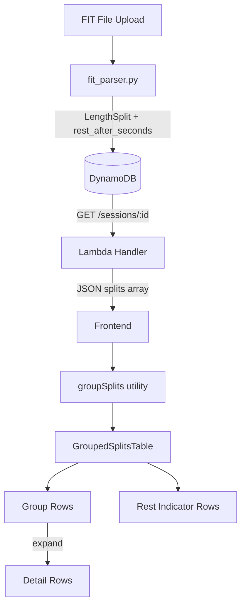
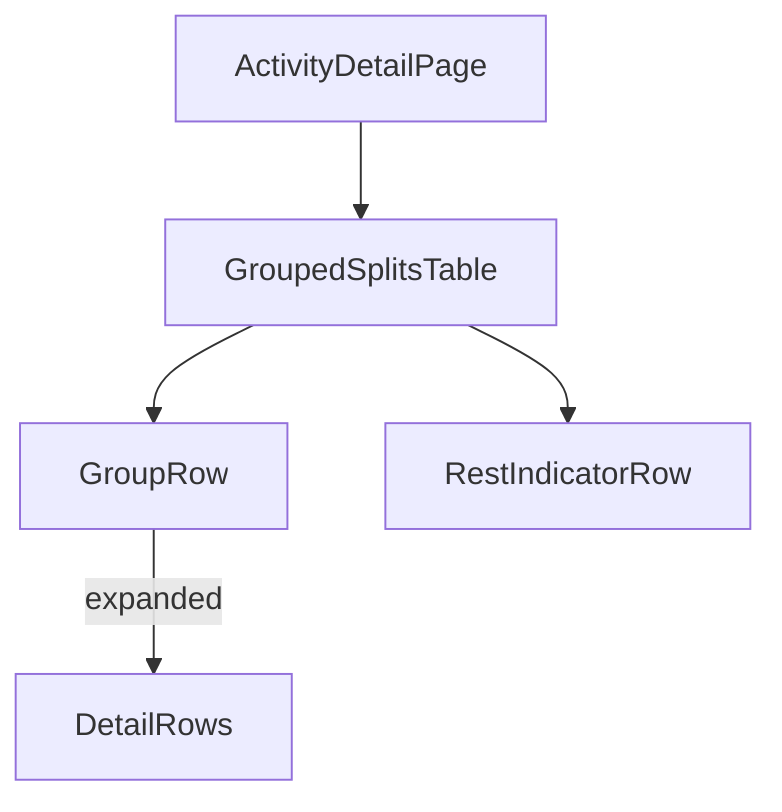

# Design Document: Grouped Splits Display

## Overview

This feature transforms the flat per-length splits table into a structured grouped view. The backend FIT parser is extended to capture rest intervals from "idle" length records and attach them to the preceding active split. The frontend replaces the existing `SplitsTable` component with a new `GroupedSplitsTable` that groups consecutive same-stroke splits (separated by rest or stroke changes) into collapsible rows showing aggregate distance, time, stroke, and pace.

The design prioritizes backward compatibility — the existing `splits` array gains a single new field (`rest_after_seconds`) without changing existing fields or ordering. The grouping logic lives entirely in the frontend, keeping the API surface minimal.

## Architecture



**Key architectural decisions:**

1. **Rest extraction at parse time** — Rest intervals are captured during FIT parsing and stored with splits in DynamoDB. This avoids re-parsing and keeps the read path simple.
2. **Grouping logic on the frontend** — The backend returns a flat splits array; the frontend groups them. This keeps the API backward-compatible and allows UI-level flexibility (e.g., future toggle between flat/grouped views).
3. **Single new field, additive change** — Adding `rest_after_seconds: float | None` to the split dict is the minimal change that enables grouping without breaking existing consumers.

## Components and Interfaces

### Backend

**Modified: `backend/models.py` — LengthSplit dataclass**

```python
@dataclass
class LengthSplit:
    """Per-length split data."""
    length_number: int
    time_seconds: float
    stroke: str
    strokes: int
    rest_after_seconds: float | None = None
```

**Modified: `backend/fit_parser.py` — extract_session_info**

The idle-length handling changes from "skip" to "capture rest duration and attach to preceding split":

```python
# Pseudocode for the modified loop:
for record in fitfile.get_messages("length"):
    if length_type is idle:
        if splits:  # discard leading idle
            splits[-1].rest_after_seconds = round(elapsed, 2)
        continue
    # ... existing active-length processing ...
```

**Modified: `backend/session_history.py` — _deserialize_splits**

Add `rest_after_seconds` to the deserialization dict comprehension:

```python
{
    "length_number": int(s.get("length_number", 0)),
    "time_seconds": float(s.get("time_seconds", 0)),
    "strokes": int(s.get("strokes", 0)),
    "stroke": str(s.get("stroke", "unknown")),
    "rest_after_seconds": float(s["rest_after_seconds"]) if s.get("rest_after_seconds") is not None else None,
}
```

### Frontend

**Modified: `frontend/src/types.ts` — LengthSplit interface**

```typescript
export interface LengthSplit {
  length_number: number;
  time_seconds: number;
  stroke: string;
  strokes: number;
  rest_after_seconds?: number | null;
}
```

**New: `frontend/src/utils/groupSplits.ts` — Pure grouping function**

```typescript
export interface SplitGroup {
  id: number;
  splits: LengthSplit[];
  totalDistance: number;
  totalTime: number;
  stroke: string;
  avgPacePer100m: number;
  restAfter: number | null;
}

export function groupSplits(splits: LengthSplit[], poolLengthM: number): SplitGroup[];
```

**New: `frontend/src/components/GroupedSplitsTable.tsx`**

Replaces `SplitsTable`. Props:

```typescript
interface GroupedSplitsTableProps {
  splits: LengthSplit[];
  poolLengthM: number;
}
```

**New: `frontend/src/utils/formatTime.ts` — Formatting utilities**

```typescript
export function formatTime(seconds: number): string;       // "1:32.5"
export function formatDistance(meters: number): string;     // "100m"
export function formatRest(seconds: number): string;       // "15s" or "1:30"
```

### Component Hierarchy



## Data Models

### Backend — LengthSplit (Python dataclass)

| Field | Type | Description |
|-------|------|-------------|
| length_number | int | 1-indexed sequential length number |
| time_seconds | float | Elapsed time for this length (2 decimal places) |
| stroke | str | Stroke type name (e.g., "freestyle") |
| strokes | int | Total stroke count for this length |
| rest_after_seconds | float \| None | Rest duration after this length, or None if no rest |

### Frontend — SplitGroup (TypeScript interface)

| Field | Type | Description |
|-------|------|-------------|
| id | number | Sequential group index (0-based) |
| splits | LengthSplit[] | Individual splits in this group |
| totalDistance | number | N × poolLengthM |
| totalTime | number | Sum of time_seconds across splits |
| stroke | string | Common stroke type for the group |
| avgPacePer100m | number | (totalTime / totalDistance) × 100 |
| restAfter | number \| null | Rest duration after this group's last split |

### DynamoDB — Splits storage

The splits array in DynamoDB gains the `rest_after_seconds` attribute on each item. Existing records without this field will deserialize as `null` (backward compatible).

### Grouping Algorithm

```
Input: splits[], poolLengthM
Output: SplitGroup[]

currentGroup = [splits[0]]
for i = 1 to splits.length - 1:
    prevSplit = splits[i - 1]
    currSplit = splits[i]
    if prevSplit.rest_after_seconds != null OR currSplit.stroke != currentGroup[0].stroke:
        emit currentGroup as SplitGroup
        currentGroup = [currSplit]
    else:
        currentGroup.push(currSplit)
emit final currentGroup as SplitGroup
```

## Correctness Properties

*A property is a characteristic or behavior that should hold true across all valid executions of a system — essentially, a formal statement about what the system should do. Properties serve as the bridge between human-readable specifications and machine-verifiable correctness guarantees.*

### Property 1: Rest extraction correctness

*For any* sequence of FIT length records containing active and idle entries, the `rest_after_seconds` field on each output split SHALL be non-null if and only if the next length record in the FIT file is idle, and the value SHALL equal that idle record's `total_elapsed_time`.

**Validates: Requirements 1.1, 1.2, 1.3**

### Property 2: Rest rounding invariant

*For any* extracted rest interval value, the `rest_after_seconds` field SHALL be rounded to exactly two decimal places.

**Validates: Requirements 1.5, 2.3**

### Property 3: Grouping boundary correctness

*For any* sequence of splits, two consecutive splits belong to the same group if and only if they share the same stroke type AND the first split has `rest_after_seconds` equal to null.

**Validates: Requirements 3.1, 3.2, 3.3**

### Property 4: Group aggregate calculations

*For any* split group containing N splits with pool length P, the group's `totalDistance` SHALL equal N × P, and the group's `totalTime` SHALL equal the sum of `time_seconds` across all N splits.

**Validates: Requirements 3.4, 3.5**

### Property 5: Pace formula correctness

*For any* split group with totalTime T and totalDistance D (where D > 0), the `avgPacePer100m` SHALL equal (T / D) × 100.

**Validates: Requirements 4.2**

### Property 6: Time formatting round-trip

*For any* positive time value in seconds, `formatTime(seconds)` SHALL produce a string in "M:SS.d" format where parsing it back yields the original value (to one decimal place precision).

**Validates: Requirements 4.6**

### Property 7: Rest formatting correctness

*For any* rest duration value, if the value is ≤ 60 seconds the formatted output SHALL be the rounded whole number followed by "s", and if > 60 seconds it SHALL be formatted as "M:SS".

**Validates: Requirements 6.2, 6.3**

### Property 8: Output schema completeness and ordering

*For any* parsed FIT session, every split in the output SHALL contain all five fields (length_number, time_seconds, stroke, strokes, rest_after_seconds), and splits SHALL be ordered by strictly increasing `length_number`.

**Validates: Requirements 2.4, 8.1, 8.3**

## Error Handling

| Scenario | Handling |
|----------|----------|
| Leading idle record (no preceding split) | Discard silently — no split to attach rest to |
| Empty splits array | `GroupedSplitsTable` renders nothing (same as current `SplitsTable`) |
| Single split in session | Renders one group row without expand indicator |
| Missing `rest_after_seconds` in legacy data | Deserialize as `null` — treated as no rest |
| Zero pool_length_m | Guard at component level; fall back to 25m default from session |
| NaN/Infinity in time calculations | Not possible — fit_parser already rounds to 2dp floats |

## Testing Strategy

### Property-Based Tests (Hypothesis — Python backend)

The backend grouping-adjacent logic (rest extraction, rounding, schema completeness) is well-suited for property-based testing. The `hypothesis` library is already used in this project.

- **Minimum 100 iterations** per property test
- Each test tagged with: `Feature: grouped-splits-display, Property {N}: {title}`

Properties to implement as PBT:
1. Rest extraction correctness (Property 1)
2. Rest rounding invariant (Property 2)
3. Output schema completeness and ordering (Property 8)

### Property-Based Tests (fast-check — TypeScript frontend)

The frontend grouping and formatting logic is pure and deterministic, ideal for PBT with `fast-check`.

Properties to implement:
4. Grouping boundary correctness (Property 3)
5. Group aggregate calculations (Property 4)
6. Pace formula correctness (Property 5)
7. Time formatting round-trip (Property 6)
8. Rest formatting correctness (Property 7)

### Unit Tests (Example-Based)

- **Backend**: Specific FIT file scenarios (leading idle, trailing idle, consecutive idles, no idles)
- **Frontend rendering**: Group row displays all four pieces of info (4.1), expand/collapse interactions (5.1–5.5), single-split groups lack expand indicator (4.3), ARIA attributes present (7.1–7.4)
- **Edge cases**: Last group rest indicator suppressed (6.5), distance formatting always ends in "m" (4.5)

### Integration Tests

- Upload a FIT file with known rest patterns → verify API response includes correct `rest_after_seconds` values
- Verify existing sessions without `rest_after_seconds` still render correctly (backward compatibility)

### Test Configuration

```
# Python (pytest + hypothesis)
@settings(max_examples=100)

# TypeScript (vitest + fast-check)
fc.assert(fc.property(...), { numRuns: 100 })
```
