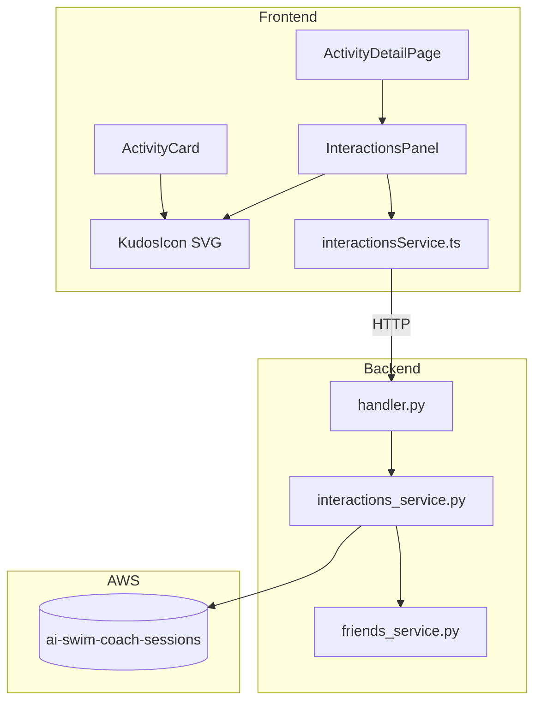

# Design Document: Social Interactions

## Overview

The Social Interactions feature adds commenting and kudos functionality to swim sessions. It enables session owners and authorized friends to post comments on shared sessions, and friends to give/remove kudos (a single thumbs-up per user per session). The feature integrates into the existing ActivityDetailPage and ActivityCard components, backed by a new `interactions_service.py` module and corresponding API routes.

### Design Decisions

1. **Storage in the sessions table as nested attributes**: Comments and kudos are stored as list attributes (`comments`, `kudos`) directly on the session item in `ai-swim-coach-sessions`. This keeps reads atomic — a single `GetItem` or `Query` retrieves the session and all its interactions without cross-table joins. The tradeoff is a 400KB DynamoDB item size limit, but with 500-char comments and realistic usage (dozens of comments/kudos per session, not thousands), this is well within bounds.

2. **Separate interactions service module**: A new `interactions_service.py` encapsulates all comment/kudos logic, following the same pattern as `friends_service.py`. This keeps the handler thin and makes the business logic unit-testable.

3. **Authorization reuses existing friends_service**: The `_get_relationship_status` and `get_friends` functions from `friends_service.py` already verify mutual friendships. The interactions service delegates friendship checks there.

4. **Kudos toggle model**: A single endpoint handles both adding and removing kudos (toggle semantics). The backend determines current state and flips it. This simplifies the frontend to a single click handler.

## Architecture



### Request Flow

1. Frontend calls `interactionsService.ts` functions (add/delete comment, toggle kudos, get interactions)
2. API Gateway routes to Lambda `handler.py`
3. Handler authenticates via `@require_auth`, extracts `user_id`
4. Handler delegates to `interactions_service.py` functions
5. Interactions service verifies authorization (ownership or friendship + shared visibility) via `friends_service.py`
6. Interactions service reads/writes `comments` and `kudos` list attributes on the session item in DynamoDB

## Components and Interfaces

### Backend

#### `interactions_service.py`

```python
def get_interactions(session_id: str, current_user_id: str) -> dict:
    """
    Retrieve comments and kudos for a session.
    
    Returns:
        {
            "comments": [{"comment_id": str, "user_id": str, "display_name": str,
                          "text": str, "created_at": str}, ...],
            "kudos_count": int,
            "user_has_kudos": bool
        }
    
    Authorization: Session owner always has access. Friends have access if
    session visibility is "shared".
    """

def add_comment(session_id: str, user_id: str, text: str) -> dict:
    """
    Add a comment to a session.
    
    Args:
        session_id: Target session UUID
        user_id: Author's user_id (from auth_context)
        text: Comment text (1-500 characters)
    
    Returns:
        {"comment_id": str, "user_id": str, "display_name": str,
         "text": str, "created_at": str}
    
    Raises:
        ValueError: Empty or >500 char text
        PermissionError: User is not owner or authorized friend
    """

def delete_comment(session_id: str, comment_id: str, user_id: str) -> None:
    """
    Delete a comment by ID.
    
    Raises:
        PermissionError: user_id does not match comment author
        ValueError: Comment not found
    """

def toggle_kudos(session_id: str, user_id: str) -> dict:
    """
    Add or remove kudos for a user on a session.
    
    Returns:
        {"action": "added" | "removed", "kudos_count": int}
    
    Raises:
        PermissionError: User is session owner, or not an authorized friend
    """
```

#### API Routes (added to `handler.py`)

| Method | Path | Description |
|--------|------|-------------|
| GET | `/sessions/{id}/interactions` | Get comments + kudos for a session |
| POST | `/sessions/{id}/comments` | Add a comment |
| DELETE | `/sessions/{id}/comments/{comment_id}` | Delete a comment |
| POST | `/sessions/{id}/kudos` | Toggle kudos |

All routes require authentication (`@require_auth`).

### Frontend

#### `interactionsService.ts` (new API module)

```typescript
export interface Comment {
  comment_id: string;
  user_id: string;
  display_name: string;
  text: string;
  created_at: string;
}

export interface InteractionsData {
  comments: Comment[];
  kudos_count: number;
  user_has_kudos: boolean;
}

export async function getInteractions(sessionId: string): Promise<InteractionsData>;
export async function addComment(sessionId: string, text: string): Promise<Comment>;
export async function deleteComment(sessionId: string, commentId: string): Promise<void>;
export async function toggleKudos(sessionId: string): Promise<{ action: 'added' | 'removed'; kudos_count: number }>;
```

#### `InteractionsPanel.tsx` (new component)

Renders below session detail content on ActivityDetailPage. Contains:
- Kudos button (KudosIcon + count)
- Comment list (sorted ascending by created_at)
- Comment input field with submit button
- Delete buttons on own comments (with confirmation)
- Loading/error states

#### `KudosIcon.tsx` (new component)

Inline SVG component accepting props:
```typescript
interface KudosIconProps {
  active: boolean;      // filled vs outline state
  size?: number;        // default 24
  onClick?: () => void; // undefined = not clickable
  className?: string;
}
```

#### `ActivityCard` (modified)

Add optional `kudosCount` prop. When > 0, render `<KudosIcon active size={16} />` with the count next to it.

## Data Models

### DynamoDB Schema Changes

The `ai-swim-coach-sessions` table items gain two new optional list attributes:

```json
{
  "user_id": "uuid-v4",
  "session_date": "2024-06-15T10:30:00Z",
  "session_id": "uuid-v4",
  // ... existing fields ...
  
  "comments": [
    {
      "comment_id": "uuid-v4",
      "user_id": "uuid-v4",
      "display_name": "Jane Doe",
      "text": "Great swim!",
      "created_at": "2024-06-15T12:00:00Z"
    }
  ],
  "kudos": [
    {
      "user_id": "uuid-v4",
      "created_at": "2024-06-15T11:30:00Z"
    }
  ]
}
```

### Field Constraints

| Field | Type | Constraints |
|-------|------|-------------|
| `comments` | List | Max ~100 items (practical DynamoDB item size limit) |
| `comments[].comment_id` | String | UUID v4, generated server-side |
| `comments[].user_id` | String | UUID v4, from auth_context |
| `comments[].display_name` | String | Denormalized from user profile at write time |
| `comments[].text` | String | 1-500 characters |
| `comments[].created_at` | String | ISO 8601, server-generated |
| `kudos` | List | Max 1 entry per unique user_id |
| `kudos[].user_id` | String | UUID v4 |
| `kudos[].created_at` | String | ISO 8601 |

### Backend Data Model (`interactions_service.py` internal)

```python
@dataclass
class CommentRecord:
    comment_id: str       # UUID v4
    user_id: str          # UUID v4
    display_name: str     # 1-100 characters
    text: str             # 1-500 characters
    created_at: str       # ISO 8601

@dataclass
class KudosRecord:
    user_id: str          # UUID v4
    created_at: str       # ISO 8601
```

### Authorization Matrix

| Action | Session Owner | Authorized Friend | Other User |
|--------|:---:|:---:|:---:|
| View interactions | ✓ | ✓ (shared only) | ✗ |
| Add comment | ✓ | ✓ (shared only) | ✗ |
| Delete own comment | ✓ | ✓ | ✗ |
| Give/remove kudos | ✗ | ✓ (shared only) | ✗ |


## Correctness Properties

*A property is a characteristic or behavior that should hold true across all valid executions of a system — essentially, a formal statement about what the system should do. Properties serve as the bridge between human-readable specifications and machine-verifiable correctness guarantees.*

### Property 1: Comment creation preserves all fields

*For any* authorized user (session owner or authorized friend) and *for any* valid comment text (1-500 non-whitespace-only characters), calling `add_comment` SHALL return a record where `comment_id` is a valid UUID v4, `user_id` matches the caller, `text` matches the input, `display_name` is non-empty, and `created_at` is a valid ISO 8601 timestamp.

**Validates: Requirements 1.2, 2.2**

### Property 2: Invalid comments are rejected

*For any* string that is empty, consists entirely of whitespace, or exceeds 500 characters, calling `add_comment` SHALL raise a ValueError and the session's comment list SHALL remain unchanged.

**Validates: Requirements 1.4**

### Property 3: Unauthorized users cannot add comments

*For any* user who is neither the session owner nor an authorized friend of the session owner, calling `add_comment` SHALL raise a PermissionError regardless of the comment text.

**Validates: Requirements 2.4, 9.1**

### Property 4: Comments are returned sorted ascending by created_at

*For any* session with one or more comments, calling `get_interactions` SHALL return the comments list where each comment's `created_at` timestamp is less than or equal to the next comment's `created_at` timestamp.

**Validates: Requirements 3.1**

### Property 5: Comment deletion removes exactly the target comment

*For any* session with comments, when the comment author calls `delete_comment` with a valid `comment_id`, calling `get_interactions` afterward SHALL return a comments list that does not contain a comment with that `comment_id`, and all other comments remain unchanged.

**Validates: Requirements 4.3**

### Property 6: Non-authors cannot delete comments

*For any* comment and *for any* user whose `user_id` differs from the comment's author `user_id`, calling `delete_comment` SHALL raise a PermissionError and the comment SHALL remain in the session.

**Validates: Requirements 4.5**

### Property 7: Kudos toggle round-trip

*For any* authorized friend and *for any* session, calling `toggle_kudos` twice in sequence SHALL return the session to its original kudos state (same count, same `user_has_kudos` value for that user).

**Validates: Requirements 5.2, 5.5**

### Property 8: Kudos uniqueness invariant

*For any* session and *for any* sequence of `toggle_kudos` calls by the same user, the kudos list SHALL contain at most one record with that user's `user_id` at any point in time.

**Validates: Requirements 5.7**

### Property 9: Kudos count correctness

*For any* session with a kudos list of length N, calling `get_interactions` SHALL return `kudos_count` equal to N, and `user_has_kudos` SHALL be `true` if and only if the current user's `user_id` appears in the kudos list.

**Validates: Requirements 6.1**

### Property 10: Session owner cannot give kudos

*For any* session, calling `toggle_kudos` with the session owner's `user_id` SHALL raise a PermissionError and the kudos list SHALL remain unchanged.

**Validates: Requirements 6.4, 9.3**

### Property 11: Non-shared sessions reject kudos

*For any* session whose owner has `Activity_Visibility` set to "not_shared", calling `toggle_kudos` from any user (including friends) SHALL raise a PermissionError.

**Validates: Requirements 9.2**

## Error Handling

### Backend Error Responses

| Scenario | HTTP Status | Response Body |
|----------|:-----------:|---------------|
| Missing/invalid auth token | 401 | `{"error": "Authorization header required"}` |
| User not authorized for session | 403 | `{"error": "You do not have permission to interact with this session"}` |
| Session not found | 404 | `{"error": "Session not found"}` |
| Invalid comment text (empty/too long) | 400 | `{"error": "Comment text must be 1-500 characters"}` |
| Comment not found for deletion | 404 | `{"error": "Comment not found"}` |
| Not comment author (delete attempt) | 403 | `{"error": "You can only delete your own comments"}` |
| Owner attempting self-kudos | 403 | `{"error": "Cannot give kudos to your own session"}` |
| DynamoDB write failure | 500 | `{"error": "Failed to save interaction. Please try again."}` |
| Rate limit exceeded | 429 | `{"error": "Too many requests. Please try again later."}` |

### Frontend Error Handling

- **Network errors**: Show inline error banner with retry button
- **403 errors**: Show "You don't have permission" message (no retry)
- **400 validation errors**: Show validation message inline near the input field
- **500 errors**: Show "Something went wrong" with retry option
- **Optimistic UI for kudos**: Toggle icon immediately, revert on failure with toast notification

### Rate Limiting

Apply rate limiting to comment creation (same pattern as `friends-request`):
- **Comment creation**: 20 requests per 60 seconds per user
- **Kudos toggle**: 30 requests per 60 seconds per user

## Testing Strategy

### Property-Based Tests (Hypothesis — Python)

The backend `interactions_service.py` logic is well-suited for PBT because:
- Authorization checks are pure-logic decisions based on user/session relationships
- Comment validation is a pure function of the input string
- Kudos uniqueness is an invariant that must hold across all operation sequences

**Library**: Hypothesis (already used in the project — see `.hypothesis/` directories)

**Configuration**: Minimum 100 examples per property test (`@settings(max_examples=100)`)

**Tag format**: `# Feature: social-interactions, Property {N}: {title}`

Each correctness property (1-11) maps to one Hypothesis test in `backend/tests/test_interactions_service.py`.

### Unit Tests (pytest — Python)

Backend unit tests covering:
- Individual function return values with concrete examples
- Error response formatting
- Handler route dispatch for new endpoints
- DynamoDB mock interactions (moto)

### Frontend Unit Tests (Vitest + React Testing Library)

- InteractionsPanel rendering states (loading, empty, populated, error)
- KudosIcon active/inactive rendering and click behavior
- Comment submission and deletion UI flows
- ActivityCard kudos indicator visibility
- Authorization-dependent UI elements (input field shown/hidden)

### Integration Tests

- End-to-end API flow: create comment → get interactions → verify comment present
- Kudos toggle flow: add → verify → remove → verify
- Authorization rejection with actual friendship checks
- Visibility change does not delete existing data

### Test File Locations

| Test File | Coverage |
|-----------|----------|
| `backend/tests/test_interactions_service.py` | Property tests + unit tests for service logic |
| `backend/tests/test_interactions_endpoints.py` | Handler route integration tests |
| `frontend/src/components/InteractionsPanel.test.tsx` | Panel rendering and behavior |
| `frontend/src/components/KudosIcon.test.tsx` | SVG icon states |
| `frontend/src/components/ActivityCard.test.tsx` | Kudos indicator on cards (extend existing) |
