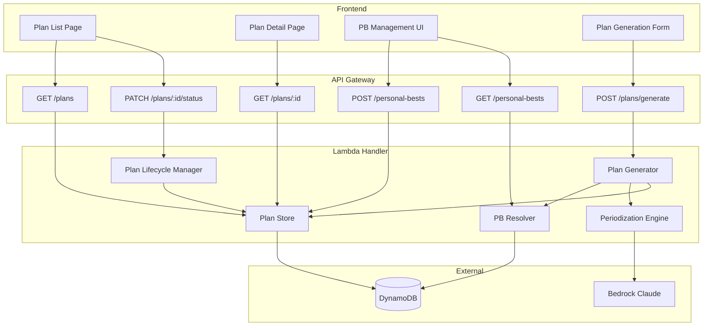

# Design Document: Structured Training Plans

## Overview

This design transforms the AI Swim Coach from generating single training sessions into a periodized multi-week training plan system. The new system generates structured plans spanning 4–12 weeks with 3–5 sessions per week, using progressive overload principles. Plans are informed by the swimmer's personal bests (manual or derived from session history) and managed through a lifecycle (Draft → Active → Archived).

The design extends the existing architecture without replacing it — the current single-session generation remains available, while new endpoints and components handle multi-week plan generation, personal best management, and plan lifecycle operations.

## Architecture



### Key Architectural Decisions

1. **Same Lambda, extended handler**: All new endpoints route through the existing `handler.py` with new path-based routing, consistent with the current pattern.
2. **Same DynamoDB table with new sort key prefixes**: Multi-week plans use `MPLAN#<created_at>` prefix on the existing SESSIONS_TABLE sort key to coexist with single-session plans (`PLAN#`) and sessions. This avoids provisioning new tables.
3. **Personal bests on UserProfiles table**: PBs are stored as a map attribute on the existing UserProfiles table item, keeping user data consolidated.
4. **Bedrock for full plan generation**: A single Bedrock call generates the entire multi-week structure using a tool-use schema. This avoids multiple round-trips while keeping the plan internally consistent.
5. **Lifecycle managed via status attribute**: Plan status transitions are validated in application code and persisted as an attribute update rather than creating new items.

## Components and Interfaces

### Backend Components

#### 1. Plan Generator (`plan_generator.py`)

Orchestrates multi-week plan creation by resolving personal bests, building the Bedrock prompt, invoking Claude, and persisting the result.

```python
def generate_multi_week_plan(
    user_id: str,
    event: str,
    target_time: str,
    weeks: int,
    sessions_per_week: int = 3,
) -> dict:
    """Generate a complete multi-week training plan.
    
    Args:
        user_id: Authenticated user ID
        event: Target event (e.g., "100m Freestyle")
        target_time: Goal time string (e.g., "0:58.5")
        weeks: Plan duration (4-12)
        sessions_per_week: Sessions per week (3-5, default 3)
    
    Returns:
        Complete plan dict with plan_id, weeks, sessions, and metadata
    
    Raises:
        ValueError: Invalid weeks or sessions_per_week
        BedrockError: AI generation failure
    """
```

#### 2. Periodization Engine (`periodization_engine.py`)

Builds the Bedrock prompt with progressive overload constraints and validates the AI output conforms to periodization rules.

```python
def build_plan_prompt(
    event: str,
    target_time: str,
    personal_best_seconds: float | None,
    weeks: int,
    sessions_per_week: int,
) -> str:
    """Build the system prompt for multi-week plan generation."""

def validate_plan_structure(plan: dict, weeks: int, sessions_per_week: int) -> bool:
    """Validate AI output matches requested structure and periodization rules."""
```

#### 3. PB Resolver (`pb_resolver.py`)

Resolves personal bests by priority: manual entry first, then derived from session history.

```python
def resolve_personal_best(user_id: str, event: str) -> float | None:
    """Resolve PB for an event. Returns time in seconds or None.
    
    Priority: manual entry > derived from session history.
    """

def derive_pb_from_history(user_id: str, stroke_type: str, distance_m: int) -> float | None:
    """Derive PB from session history using pace degradation scaling."""

def save_personal_best(user_id: str, event: str, time_seconds: float) -> None:
    """Persist a manually entered personal best."""

def get_personal_bests(user_id: str) -> list[dict]:
    """Return all PBs (manual + derived) for a user."""
```

#### 4. Plan Lifecycle Manager (`plan_lifecycle.py`)

Manages state transitions with validation.

```python
VALID_TRANSITIONS = {
    "draft": {"active"},
    "active": {"archived"},
}

def activate_plan(user_id: str, plan_id: str) -> None:
    """Activate a plan. Archives any currently active plan first."""

def archive_plan(user_id: str, plan_id: str) -> None:
    """Archive an active plan."""

def get_plan_status(user_id: str, plan_id: str) -> str:
    """Get current status of a plan."""
```

#### 5. Plan Store (`structured_plan_store.py`)

Persistence layer for multi-week plans. Extends the pattern from existing `training_plan_store.py`.

```python
def save_structured_plan(user_id: str, plan: dict) -> str:
    """Save a complete multi-week plan. Returns plan_id."""

def get_user_structured_plans(user_id: str) -> list[dict]:
    """Get plan summaries for a user (without full session content)."""

def get_plan_by_id(user_id: str, plan_id: str) -> dict | None:
    """Get a complete plan by ID including all weeks and sessions."""

def update_plan_status(user_id: str, plan_id: str, new_status: str) -> None:
    """Update plan status and record transition timestamp."""
```

### Frontend Components

#### 1. `StructuredPlanForm` Component
Multi-week plan generation form with event, target time, duration (weeks), and sessions/week inputs.

#### 2. `PlanListView` Component
Displays all plans with status badges, supporting activate/archive actions.

#### 3. `PlanDetailView` Component
Week-by-week expandable view showing all sessions within each week.

#### 4. `PersonalBestManager` Component
Form for manual PB entry and display of both manual and derived PBs.

### API Endpoints

| Method | Path | Description |
|--------|------|-------------|
| POST | `/plans/generate` | Generate a multi-week plan |
| GET | `/plans` | List user's plans (summaries) |
| GET | `/plans/:plan_id` | Get full plan detail |
| PATCH | `/plans/:plan_id/status` | Update plan status |
| POST | `/personal-bests` | Save a manual PB |
| GET | `/personal-bests` | Get all PBs (manual + derived) |

## Data Models

### Multi-Week Plan (DynamoDB Item)

```
Partition Key: user_id
Sort Key: MPLAN#<created_at_iso>

Attributes:
  plan_id: str (UUID v4)
  user_id: str
  created_at: str (ISO 8601)
  status: str ("draft" | "active" | "archived")
  status_updated_at: str (ISO 8601)
  goal: {
    event: str
    target_time: str
    personal_best_seconds: float | null
  }
  duration_weeks: int (4-12)
  sessions_per_week: int (3-5)
  weeks: [
    {
      week_number: int (1-based)
      sessions: [
        {
          session_title: str
          session_type: str ("endurance" | "speed" | "technique" | "threshold")
          warm_up: [str]
          main_set: [str]
          cool_down: [str]
          total_distance: int
          focus_notes: str
        }
      ]
    }
  ]
```

### Personal Best (UserProfiles table attribute)

```
Existing UserProfiles item extended with:
  personal_bests: {
    "<event_name>": {
      time_seconds: float
      source: str ("manual" | "derived")
      updated_at: str (ISO 8601)
    }
  }
```

### Session Template (within a Week Block)

```python
@dataclass
class SessionTemplate:
    session_title: str
    session_type: str  # "endurance" | "speed" | "technique" | "threshold"
    warm_up: list[str]
    main_set: list[str]
    cool_down: list[str]
    total_distance: int
    focus_notes: str
```

### Structured Plan (Python dataclass)

```python
@dataclass
class WeekBlock:
    week_number: int
    sessions: list[SessionTemplate]

@dataclass
class StructuredTrainingPlan:
    plan_id: str
    user_id: str
    created_at: str
    status: str  # "draft" | "active" | "archived"
    status_updated_at: str
    goal: dict  # {event, target_time, personal_best_seconds}
    duration_weeks: int
    sessions_per_week: int
    weeks: list[WeekBlock]
```

### Bedrock Tool Schema for Multi-Week Plan

```python
MULTI_WEEK_PLAN_TOOL_SCHEMA = {
    "name": "submit_multi_week_plan",
    "description": "Submit a structured multi-week swim training plan",
    "input_schema": {
        "type": "object",
        "properties": {
            "weeks": {
                "type": "array",
                "items": {
                    "type": "object",
                    "properties": {
                        "week_number": {"type": "integer"},
                        "sessions": {
                            "type": "array",
                            "items": {
                                "type": "object",
                                "properties": {
                                    "session_title": {"type": "string"},
                                    "session_type": {
                                        "type": "string",
                                        "enum": ["endurance", "speed", "technique", "threshold"]
                                    },
                                    "warm_up": {"type": "array", "items": {"type": "string"}},
                                    "main_set": {"type": "array", "items": {"type": "string"}},
                                    "cool_down": {"type": "array", "items": {"type": "string"}},
                                    "total_distance": {"type": "integer"},
                                    "focus_notes": {"type": "string"}
                                },
                                "required": ["session_title", "session_type", "warm_up",
                                             "main_set", "cool_down", "total_distance", "focus_notes"]
                            }
                        }
                    },
                    "required": ["week_number", "sessions"]
                }
            }
        },
        "required": ["weeks"]
    }
}
```


## Correctness Properties

*A property is a characteristic or behavior that should hold true across all valid executions of a system — essentially, a formal statement about what the system should do. Properties serve as the bridge between human-readable specifications and machine-verifiable correctness guarantees.*

### Property 1: Plan structure matches request parameters

*For any* valid plan generation request with `weeks` in [4,12] and `sessions_per_week` in [3,5], the generated plan SHALL contain exactly `weeks` Week_Blocks, and each Week_Block SHALL contain exactly `sessions_per_week` Session_Templates.

**Validates: Requirements 1.1, 1.3**

### Property 2: Parameter validation rejects invalid input

*For any* integer value for `weeks` outside [4,12] or `sessions_per_week` outside [3,5], the Plan_Generator SHALL reject the request with a validation error rather than producing a plan.

**Validates: Requirements 1.2, 1.4, 8.5**

### Property 3: Every session contains required fields with valid types

*For any* generated plan, every Session_Template across all Week_Blocks SHALL contain a non-empty session_title, a session_type from {"endurance", "speed", "technique", "threshold"}, a non-empty warm_up list, a non-empty main_set list, a non-empty cool_down list, a positive total_distance, and non-empty focus_notes.

**Validates: Requirements 1.6, 2.2**

### Property 4: No consecutive same session types within a week

*For any* Week_Block in a generated plan, no two adjacent Session_Templates SHALL have the same session_type.

**Validates: Requirements 2.3**

### Property 5: Progressive intensity with recovery weeks

*For any* generated plan with 6 or more weeks, the overall trend of total_distance across weeks SHALL be increasing, AND at least one week SHALL have a lower total_distance than its immediately preceding week (recovery week).

**Validates: Requirements 2.1, 2.4**

### Property 6: Personal best persistence round trip

*For any* valid event name and time_seconds value, saving a personal best and then retrieving personal bests for that user SHALL return an entry with the same event name and time_seconds.

**Validates: Requirements 3.1, 3.2**

### Property 7: Manual personal best takes priority over derived

*For any* user who has both a manually entered personal best and a derived personal best for the same event, the PB_Resolver SHALL return the manually entered value.

**Validates: Requirements 3.3, 7.4**

### Property 8: Derived PB uses fastest matching pace

*For any* set of sessions with varying paces for a given stroke type, the PB_Resolver SHALL derive the personal best from the session with the fastest (lowest) average pace per 100m for the matching stroke.

**Validates: Requirements 3.4, 7.1**

### Property 9: Pace degradation scaling is monotonically increasing

*For any* base pace and two distances where distance_a < distance_b, the scaled time for distance_b SHALL be greater than the scaled time for distance_a.

**Validates: Requirements 7.2**

### Property 10: Plan lifecycle invariant — at most one active plan

*For any* sequence of lifecycle operations (activate, archive) on a user's plans, at most one plan SHALL have "active" status at any point in time. New plans SHALL start as "draft", activation SHALL move draft→active while archiving any currently active plan, and archiving SHALL move active→archived.

**Validates: Requirements 4.1, 4.2, 4.3, 4.4, 4.5**

### Property 11: Plan persistence round trip preserves all data

*For any* valid StructuredTrainingPlan, saving it to the Plan_Store and then retrieving it by plan_id SHALL return an equivalent plan with all Week_Blocks, Session_Templates, goal parameters, status, and metadata intact.

**Validates: Requirements 6.1, 6.2, 6.4**

### Property 12: Plans returned in descending creation order

*For any* set of plans belonging to a user, retrieving the plan list SHALL return them sorted by created_at in descending order (most recent first).

**Validates: Requirements 6.3**

### Property 13: Status update persists with transition timestamp

*For any* valid status transition on a plan, after the update, the stored plan SHALL reflect the new status and SHALL have a status_updated_at timestamp that is equal to or later than the previous status_updated_at.

**Validates: Requirements 6.5**

## Error Handling

### Backend Errors

| Error Scenario | Response Code | Behavior |
|---------------|---------------|----------|
| Invalid weeks (outside 4-12) | 400 | Return validation error with descriptive message |
| Invalid sessions_per_week (outside 3-5) | 400 | Return validation error with descriptive message |
| Missing required fields (event, target_time) | 400 | Return validation error listing missing fields |
| Invalid status transition (e.g., archived→active) | 400 | Return error describing valid transitions |
| Plan not found | 404 | Return "Plan not found" error |
| PB time_seconds not positive | 400 | Return validation error |
| Bedrock invocation failure | 502 | Return "Plan generation failed" with retry guidance |
| Bedrock returns malformed plan structure | 502 | Retry once; if still invalid, return error |
| DynamoDB write failure (plan save) | 500 | Return "Failed to save plan" |
| DynamoDB read failure | 500 | Return "Failed to retrieve plan" |
| Unauthenticated request | 401 | Return "Authentication required" |

### Bedrock Response Validation

After receiving the AI-generated plan from Bedrock:
1. Validate the response has exactly `weeks` week blocks
2. Validate each week has exactly `sessions_per_week` sessions
3. Validate all session types are from the allowed set
4. Validate no two consecutive sessions in a week have the same type
5. If validation fails, retry once with an adjusted prompt
6. If retry also fails, return 502 error to the client

### Frontend Error States

- **Generation in progress**: Show loading skeleton with estimated wait time
- **Generation failed**: Show error message with retry button
- **Plan load failed**: Show error state with refresh option
- **Status update failed**: Show toast notification, revert optimistic UI update
- **Network error**: Show offline indicator with cached data if available

## Testing Strategy

### Property-Based Testing (Hypothesis)

This feature is well-suited for property-based testing because it contains:
- Pure validation logic (parameter boundaries, state transitions)
- Data transformation (pace degradation scaling)
- Round-trip persistence (save/load plans and PBs)
- Invariant maintenance (at most one active plan, structural constraints)

**Library**: Hypothesis (Python) — already in use in the project (`.hypothesis/` directory exists)

**Configuration**: Minimum 100 examples per property test

**Property tests to implement**:
- Property 1: Plan structure matches request parameters
- Property 2: Parameter validation rejects invalid input
- Property 3: Every session contains required fields with valid types
- Property 4: No consecutive same session types within a week
- Property 5: Progressive intensity with recovery weeks
- Property 6: Personal best persistence round trip
- Property 7: Manual personal best takes priority over derived
- Property 8: Derived PB uses fastest matching pace
- Property 9: Pace degradation scaling is monotonically increasing
- Property 10: Plan lifecycle invariant — at most one active plan
- Property 11: Plan persistence round trip preserves all data
- Property 12: Plans returned in descending creation order
- Property 13: Status update persists with transition timestamp

Each test tagged with: `# Feature: structured-training-plans, Property {N}: {title}`

### Unit Tests (Example-Based)

- Default sessions_per_week is 3 when not specified (Req 1.5)
- Plan generation includes PB in Bedrock prompt when available (Req 3.5)
- Plan generation uses target_time when no PB available (Req 3.6)
- Plan detail view renders week structure correctly (Req 5.1, 5.2)
- Plan list shows status badges (Req 5.4, 5.5)
- Archived plans remain readable (Req 4.6)

### Integration Tests

- Full POST /plans/generate request/response cycle (Req 8.1)
- GET /plans returns user's plan list (Req 8.2)
- GET /plans/:id returns complete plan (Req 8.3)
- PATCH /plans/:id/status performs transitions (Req 8.4)
- POST /personal-bests persists entry (Req 8.6)
- GET /personal-bests returns manual + derived (Req 8.7)
- Derived PB updates when new faster session uploaded (Req 7.3)

### Frontend Tests

- Component rendering tests for PlanDetailView, PlanListView, PersonalBestManager
- Form validation in StructuredPlanForm (weeks, sessions_per_week boundaries)
- Loading/error state transitions
- API service function tests with mocked fetch
