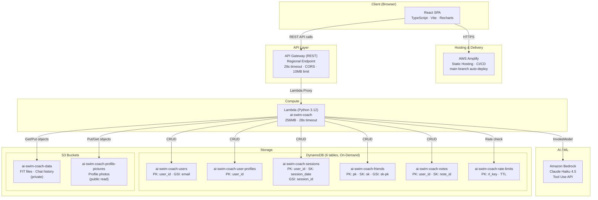
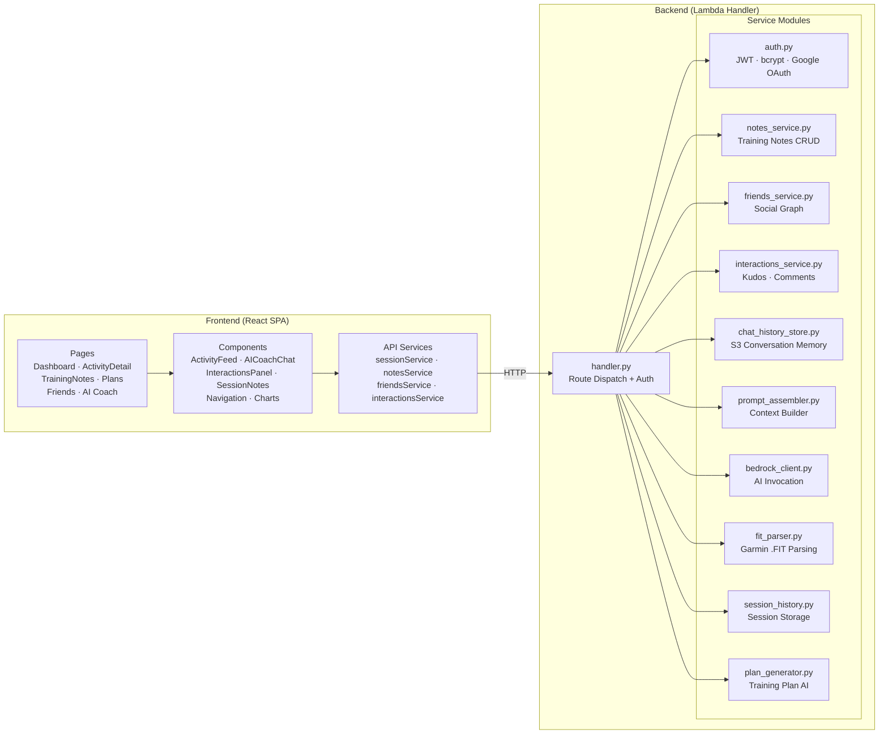
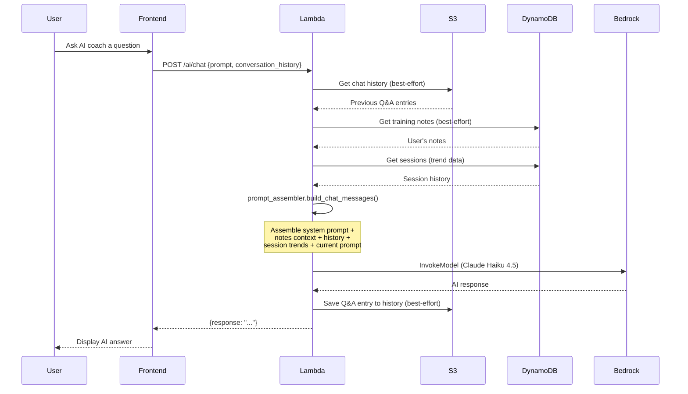
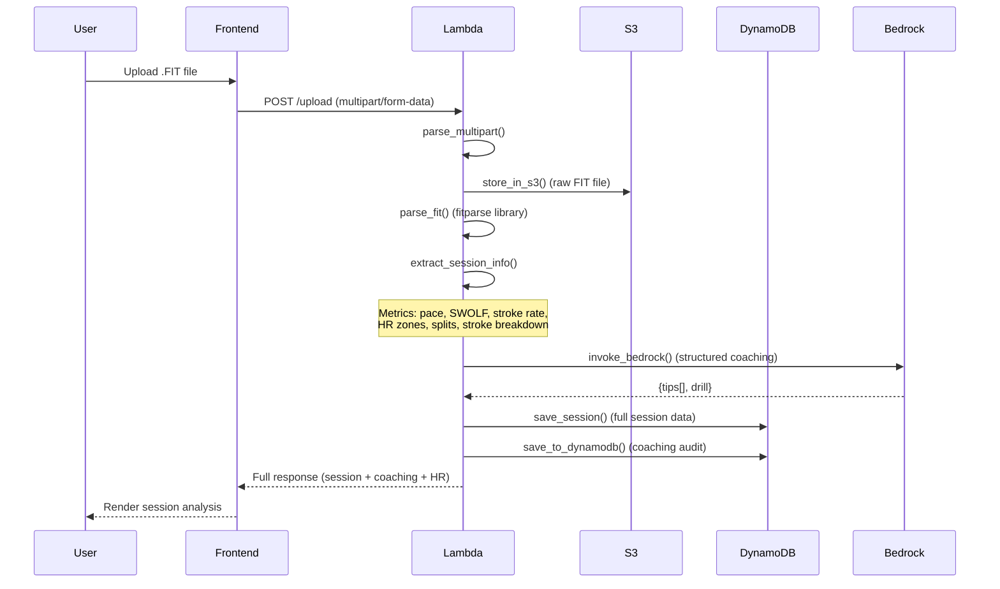

# AI Swim Coach — Architecture

## System Overview

## Detailed Component Architecture

## AI Coach Data Flow

## FIT Upload Pipeline

## Infrastructure Summary

| Component | Service | Configuration |
|-----------|---------|---------------|
| Frontend Hosting | AWS Amplify | Auto-deploy from `main`, Vite build |
| API | API Gateway (REST) | Regional, proxy integration, 10MB payload |
| Compute | Lambda | Python 3.12, 256MB, 28s timeout |
| AI Model | Bedrock | Claude Haiku 4.5 (Tool Use API) |
| User Data | DynamoDB | 6 tables, on-demand billing |
| File Storage | S3 | 2 buckets (FIT files + profile pics) |
| Auth | Custom JWT | bcrypt (cost 12), 7-day tokens |
| IaC | Terraform | AWS provider ~> 5.0 |
| CI/CD | Amplify + Manual | Frontend auto-deploy, backend via script |

## Security

- **Auth**: Custom JWT (HS256) with bcrypt password hashing + Google OAuth
- **Rate Limiting**: DynamoDB-backed per-IP throttling (10 req/15min on auth endpoints)
- **Transport**: HTTPS enforced via HSTS headers
- **Headers**: X-Frame-Options: DENY, X-Content-Type-Options: nosniff
- **S3**: FIT uploads fully private; profile pictures public-read
- **CORS**: Restricted to Amplify origin
- **API Gateway**: Custom error responses (413, 4XX, 5XX) with CORS headers

## Tech Stack

| Layer | Technologies |
|-------|-------------|
| Frontend | React 18, TypeScript, Vite, Recharts, react-router-dom v6, CSS (design tokens) |
| Backend | Python 3.12, fitparse, boto3, bcrypt, PyJWT |
| AI | Amazon Bedrock — Claude Haiku 4.5 |
| Testing | Vitest + fast-check (frontend), Pytest + Hypothesis (backend) |
| Infrastructure | Terraform, AWS (Amplify, API GW, Lambda, DynamoDB, S3, Bedrock) |
