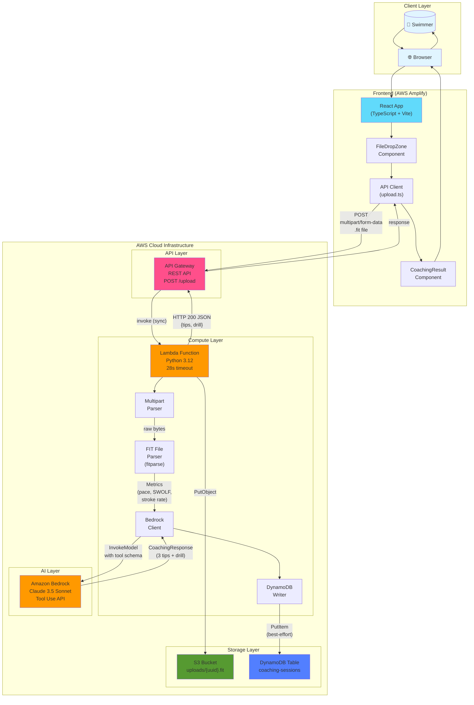
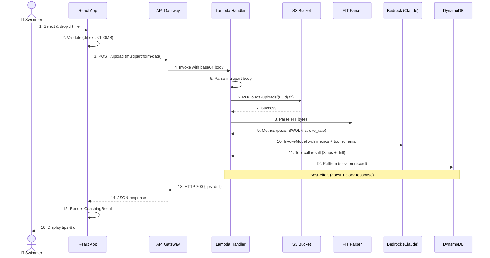
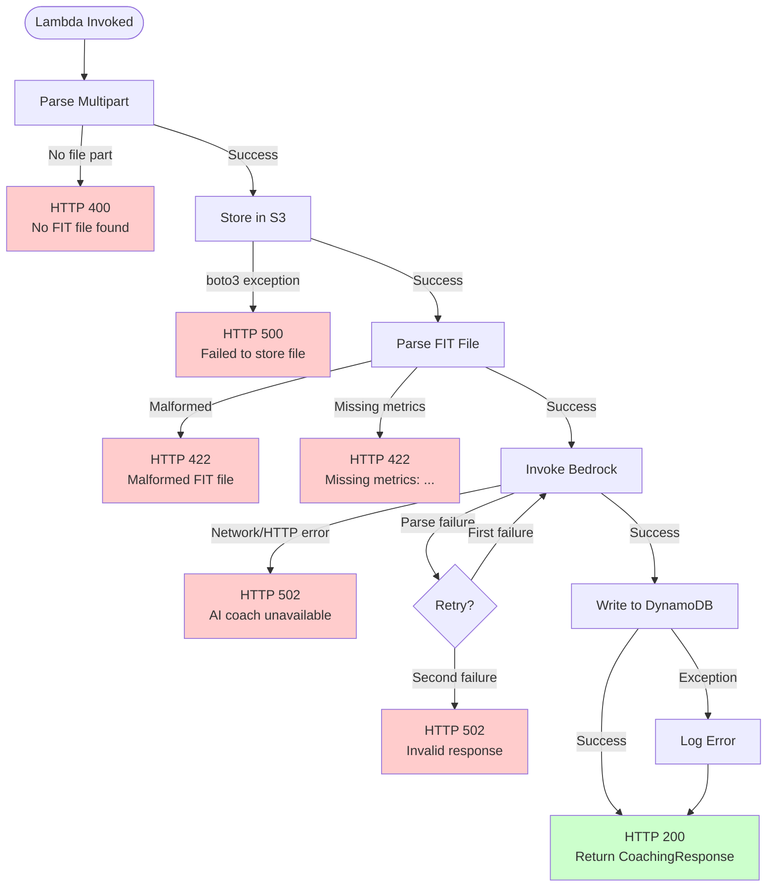
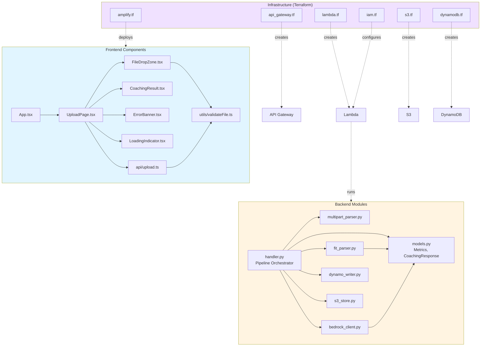

# AI Swim Coach

Upload a Garmin `.fit` file from your swim workout and get personalized coaching feedback powered by AI. The system extracts pace, SWOLF, and stroke rate from your file, sends them to an elite AI swim coach (Claude 3.5 Sonnet via Amazon Bedrock), and returns three actionable tips plus one drill recommendation.

## Architecture

### High-Level Architecture



### Detailed Data Flow



### Error Handling Flow



### Component Relationships



## Project Structure

```
aiswimcoach/
├── backend/                  # Python Lambda function
│   ├── handler.py            # Lambda entry point (pipeline orchestrator)
│   ├── multipart_parser.py   # Extracts .fit bytes from multipart body
│   ├── fit_parser.py         # Parses FIT files → Metrics (pace, SWOLF, stroke rate)
│   ├── s3_store.py           # Stores raw files in S3
│   ├── bedrock_client.py     # Invokes Claude via Bedrock Tool Use API
│   ├── dynamo_writer.py      # Persists coaching responses to DynamoDB
│   ├── models.py             # Metrics and CoachingResponse dataclasses
│   ├── requirements.txt      # Production dependencies
│   ├── requirements-dev.txt  # Test dependencies (pytest, hypothesis, moto)
│   └── tests/                # Unit and property-based tests
├── frontend/                 # React + TypeScript (Vite)
│   ├── src/
│   │   ├── pages/UploadPage.tsx
│   │   ├── components/       # FileDropZone, CoachingResult, ErrorBanner
│   │   ├── api/upload.ts     # API client with error mapping
│   │   ├── utils/validateFile.ts
│   │   └── types.ts
│   ├── package.json
│   └── vite.config.ts
├── infra/                    # Terraform (AWS infrastructure)
│   ├── main.tf              # Provider configuration
│   ├── api_gateway.tf       # REST API, POST /upload, CORS, binary media
│   ├── lambda.tf            # Lambda function (Python 3.12, 28s timeout)
│   ├── s3.tf                # Uploads bucket (private)
│   ├── dynamodb.tf          # coaching-sessions table
│   ├── iam.tf               # Lambda role + permissions
│   ├── amplify.tf           # Amplify app + branch
│   └── outputs.tf           # API Gateway URL, bucket name, etc.
└── .kiro/specs/             # Requirements, design, and task specs
```

## Getting Started

### Prerequisites

- Python 3.12+
- Node.js 18+
- Terraform 1.5+
- AWS CLI configured with credentials
- A GitHub repository (for Amplify deployments)

### Backend Setup

```bash
cd backend
python -m venv ../.venv
source ../.venv/bin/activate
pip install -r requirements.txt -r requirements-dev.txt
```

### Frontend Setup

```bash
cd frontend
npm install
npm run dev          # Development server
npm run build        # Production build
```

### Running Tests

```bash
# Backend (44 tests)
PYTHONPATH=. .venv/bin/pytest backend/tests/ -v

# Frontend (18 tests)
cd frontend && npx vitest run
```

## Deployment

### 1. Package the Lambda

```bash
cd backend
pip install -r requirements.txt -t package/
cp -r *.py package/
cd package && zip -r ../../backend.zip . && cd ../..
```

### 2. Deploy Infrastructure

```bash
cd infra
terraform init
terraform plan -var="repository_url=https://github.com/magnus-hs/aiswimcoach"
terraform apply -var="repository_url=https://github.com/magnus-hs/aiswimcoach"
```

### 3. Set Frontend Environment

After `terraform apply`, grab the API Gateway URL from the output:

```bash
terraform output api_gateway_url
```

This is automatically wired into the Amplify build via the `VITE_API_ENDPOINT` environment variable.

## API

### POST /upload

Upload a `.fit` file and receive coaching feedback.

**Request:** `multipart/form-data` with a `file` field containing the `.fit` file (max 10 MB).

**Success Response (200):**
```json
{
  "tips": [
    "Focus on maintaining a high elbow catch to reduce drag.",
    "Breathe bilaterally to balance your stroke.",
    "Increase kick tempo in the final 25m of each rep."
  ],
  "drill": "Single-arm freestyle: 4x50m each arm, focusing on high elbow recovery and hand entry in front of shoulder."
}
```

**Error Responses:**
| Status | Meaning |
|--------|---------|
| 400 | No .fit file found in request |
| 413 | Payload exceeds 10 MB |
| 422 | Malformed file or missing metrics |
| 502 | AI coach unavailable |

## Tech Stack

- **Frontend:** React 18, TypeScript, Vite, react-dropzone
- **Backend:** Python 3.12, fitparse, boto3
- **AI:** Amazon Bedrock (Claude 3.5 Sonnet) with Tool Use API
- **Infrastructure:** API Gateway (REST), Lambda, S3, DynamoDB, Amplify
- **IaC:** Terraform
- **Testing:** pytest + hypothesis (backend), Vitest + fast-check (frontend)

## License

MIT
