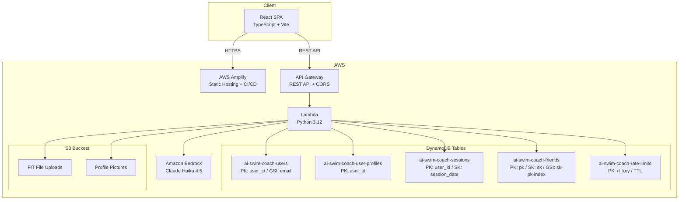
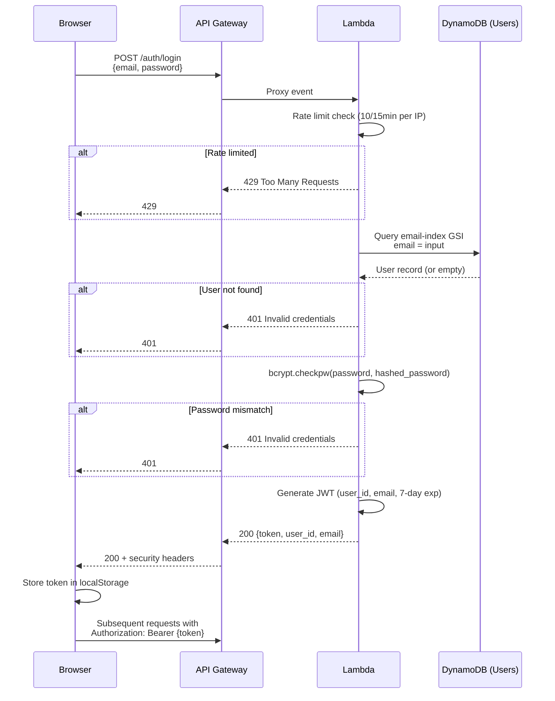

# AI Swim Coach

A comprehensive swim training analytics platform. Upload Garmin `.fit` files from pool swims to get detailed session analysis, AI coaching tips, heart rate tracking, personal best management, structured training plans, training load analysis, goals tracking, and a social friends network.

**Live:** https://main.d3qbayea55l8tl.amplifyapp.com

## Features

### Session Analysis
- **Lap-based grouping** — uses Garmin lap messages for accurate set structure (1×400m, 4×100m, etc.)
- **Grouped splits view** — consecutive same-stroke lengths grouped into reps with expandable detail
- **Rest intervals** — rest duration between sets from lap boundaries
- **Cumulative distance and time** — running totals per rep and across the session
- **Per-length metrics** — time, strokes, distance per stroke, stroke type, heart rate, SWOLF
- **Stroke breakdown** — per-session percentage of each stroke used (e.g. 95% Free · 5% Breast)

### Performance Charts
- **Heart rate over time** — line chart with time/distance toggle on x-axis
- **SWOLF technique chart** — tracks technique degradation under fatigue with drift detection
- **Efficiency curve** — stroke rate vs pace scatter plot showing your optimal "sweet spot"
- **Distance per stroke & strokes per minute** — technique metrics charted per length
- **Training load analysis** — energy system categorization (Sprint/Threshold/Aerobic) with rest-adjusted load scoring

### Training Load & CSS
- **Critical Swim Speed (CSS)** — calculate from 400m/200m time trials, stored in profile
- **Energy system categorization** — each set classified as Sprint, Threshold, or Aerobic relative to CSS
- **Rest-adjusted load** — work-to-rest ratio multiplier accounts for recovery between sets

### Goals
- **Focus goals** — qualitative targets (endurance, speed, technique, CSS, race prep, recovery, fitness, open water)
- **Distance goals** — measurable weekly, monthly, and yearly distance targets with progress bars
- **Target race** — specific event + time + date
- **AI integration** — goals steer the AI Coach's analysis and comparisons

### Dashboard
- **Activity feed** — chronological session list with progressive reveal (7 initial, +5 on scroll)
- **3-column activity cards** (desktop) — snapshot | session structure | stroke % breakdown
- **Distance charts** — weekly, monthly, yearly with per-chart goal indicators
- **Stats** — total sessions, swims per week/month/YTD, total distance and time
- **Friends tab** — switch between "My Activities" and "Friends' Activities"

### Personal Bests
- **Manual entry** — stroke/distance dropdowns with custom distance support
- **Derived PBs** — automatically detected from actual continuous sets (no estimation)
- **Grouped display** — table format grouped by stroke with manual vs derived comparison

### Training Plans
- **AI-generated multi-week plans** — structured periodization from Bedrock
- **Plan lifecycle** — draft → active → archived with single-active-plan invariant
- **Week/session breakdown** — warm-up, main set, cool-down for each session

### AI Coach
- **Interactive chat** — ask anything about your training, trends, and comparisons
- **Intent steering** — selectable focus categories (technique, speed, endurance, etc.)
- **Age-group comparison** — British Masters and Scottish Swimming time standards
- **Goals-aware** — assesses how close you are to your targets
- **Pre-computed classifications** — avoids AI arithmetic errors on time/pace

### Friends Network
- **Search** — find other swimmers by name or email
- **Friend requests** — send, accept, decline with real-time UI updates
- **Privacy control** — toggle activity sharing on/off (defaults to private)
- **Friends' activity feed** — see what your friends are swimming
- **Invite** — share a registration link via copy or native share sheet

### Profile & Auth
- **JWT authentication** — email/password with bcrypt (cost 12)
- **Google Sign-In** — verified via Google tokeninfo endpoint
- **Password reset** — cryptographic token, constant-time comparison
- **Rate limiting** — DynamoDB-backed per-IP throttling on auth endpoints
- **Profile** — age (from DOB), nationality, locality, ability level, profile picture

## Architecture



### Tech Stack

| Layer | Technology |
|-------|-----------|
| Frontend | React 18, TypeScript, Vite, Recharts, plain CSS (design tokens) |
| Backend | Python 3.12 Lambda, fitparse, boto3, bcrypt, PyJWT |
| AI | Amazon Bedrock — Claude Haiku 4.5 (`us.anthropic.claude-haiku-4-5-20251001-v1:0`) |
| Database | DynamoDB (5 tables, PAY_PER_REQUEST) |
| Storage | S3 (FIT files, profile pictures) |
| API | API Gateway (REST, proxy integration) |
| Hosting | AWS Amplify (auto-deploy from GitHub `main`) |
| Security | JWT (HS256, 7-day), bcrypt cost-12, rate limiting, CORS locked, security headers |
| Testing | pytest + Hypothesis (backend 359 tests), Vitest (frontend) |

## Login Sequence Diagram



## Project Structure

```
aiswimcoach/
├── backend/
│   ├── handler.py              # Lambda entry point, API routing (50+ routes)
│   ├── fit_parser.py           # FIT file parsing (lap-based rest detection)
│   ├── session_history.py      # DynamoDB session persistence + stroke breakdown
│   ├── friends_service.py      # Friends network (search, requests, activities)
│   ├── pb_resolver.py          # Personal best management (continuous-set derived)
│   ├── plan_lifecycle.py       # Training plan state machine
│   ├── plan_generator.py       # AI plan generation via Bedrock
│   ├── bedrock_client.py       # Bedrock coaching invocation
│   ├── hr_zones.py             # Heart rate zone calculation
│   ├── profile_manager.py      # User profile CRUD + picture upload
│   ├── rate_limit.py           # DynamoDB-backed per-IP rate limiter
│   ├── http_headers.py         # CORS + security headers (centralised)
│   ├── auth.py                 # Registration, login, JWT, bcrypt, Google verify
│   ├── middleware.py           # @require_auth decorator
│   ├── models.py               # Dataclasses (Session, Metrics, HRZones, etc.)
│   ├── swim_standards.py       # British Masters + Scottish time standards
│   └── tests/                  # 359 tests (pytest + hypothesis)
├── frontend/
│   ├── src/
│   │   ├── pages/              # Dashboard, Activity, CSS, Goals, Friends, AI Coach, etc.
│   │   ├── components/         # ActivityCard, GroupedSplitsTable, HRTimeGraph, Sidebar, etc.
│   │   ├── api/                # sessionService, friendsService, planService, upload
│   │   ├── utils/              # groupSplits, strokeBreakdown, pbValidation
│   │   └── types.ts            # Shared TypeScript interfaces
│   └── package.json
├── infra/
│   ├── dynamodb.tf             # DynamoDB table definitions (Terraform)
│   ├── iam.tf                  # Lambda role + inline policy
│   └── setup-friends-table.sh  # Friends table creation script
└── .kiro/specs/                # Feature specifications (requirements → design → tasks)
```

## Getting Started

### Prerequisites
- Python 3.12+, Node.js 18+, AWS CLI configured

### Backend
```bash
cd backend
python -m venv ../.venv && source ../.venv/bin/activate
pip install -r requirements.txt -r requirements-dev.txt
python -m pytest tests/ -v  # Run 359 tests
```

### Frontend
```bash
cd frontend
npm install
npm run dev       # Development server
npm run build     # Production build
npx tsc --noEmit  # Type check
```

### Deploy
```bash
# Lambda
bash build-lambda.sh
aws lambda update-function-code --function-name ai-swim-coach \
  --zip-file fileb://backend.zip --region us-east-1

# Frontend (auto-deploys on push to main)
git push origin main
```

## API Endpoints

### Authentication
| Method | Path | Description |
|--------|------|-------------|
| POST | /auth/register | Register new user |
| POST | /auth/login | Login (returns JWT) |
| POST | /auth/google | Google Sign-In |
| GET | /auth/verify | Verify JWT token |
| GET | /auth/user | Get user info |
| POST | /auth/reset-request | Request password reset |
| POST | /auth/reset-password | Complete password reset |

### Profile
| Method | Path | Description |
|--------|------|-------------|
| POST | /profile | Save user profile |
| GET | /profile | Get user profile |
| POST | /profile/picture | Upload profile picture |
| POST | /profile/css | Save CSS pace |
| GET | /profile/css | Get CSS pace |
| POST | /profile/goals | Save goals |
| GET | /profile/goals | Get goals |
| GET | /profile/assessment | Get ability assessment + standards |

### Sessions
| Method | Path | Description |
|--------|------|-------------|
| POST | /upload | Upload FIT file(s) |
| GET | /sessions | List user sessions |
| GET | /sessions/:id | Get session detail |

### Personal Bests
| Method | Path | Description |
|--------|------|-------------|
| POST | /personal-bests | Save manual PB |
| GET | /personal-bests | Get all PBs |
| DELETE | /personal-bests | Remove a PB |

### Training Plans
| Method | Path | Description |
|--------|------|-------------|
| POST | /plans/generate | Generate structured plan |
| GET | /plans/structured | List all plans |
| GET | /plans/:id | Get plan detail |
| PATCH | /plans/:id/status | Activate/archive |

### Friends Network
| Method | Path | Description |
|--------|------|-------------|
| GET | /friends/search?q= | Search users |
| POST | /friends/request | Send friend request |
| GET | /friends/requests | List pending requests |
| POST | /friends/requests/:id/accept | Accept request |
| POST | /friends/requests/:id/decline | Decline request |
| GET | /friends | List friends |
| DELETE | /friends/:id | Remove friend |
| GET | /friends/activities | Get friends' sessions |
| PUT | /friends/visibility | Set activity sharing |
| GET | /friends/visibility | Get sharing status |

### AI
| Method | Path | Description |
|--------|------|-------------|
| POST | /ai/chat | Interactive AI coaching |

## Security

- JWT tokens (HS256) with 7-day expiry
- Passwords hashed with bcrypt (cost factor 12)
- Google ID tokens verified server-side via Google tokeninfo endpoint
- Rate limiting on auth endpoints (DynamoDB-backed, per-IP)
- CORS locked to Amplify origin
- Security headers: HSTS, X-Content-Type-Options, X-Frame-Options, Referrer-Policy
- Password reset uses cryptographic tokens with constant-time comparison

## License

MIT
